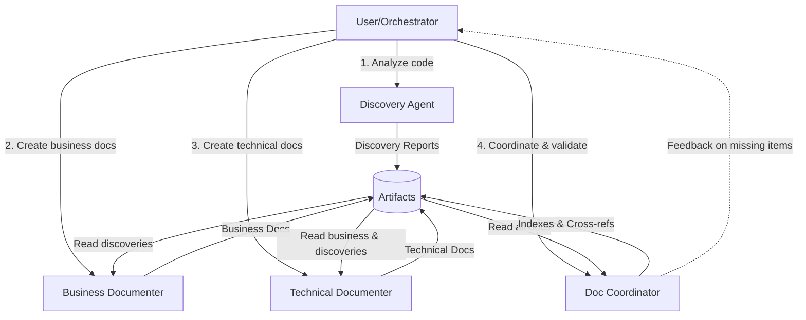

# Multi-Agent System Design for Repository Documentation

## Overview

This document proposes a decomposed agent architecture for semi-automated repository documentation following Domain-Driven Design principles and the specified documentation structure.

## Agent Architecture

### Design Principles
- **Focused Responsibility**: Each agent has a clear, bounded context
- **Minimized Handover**: Agents can work independently with clear outputs
- **Context Efficiency**: Each agent manages a specific slice of information
- **Semi-Manual Orchestration**: User can invoke agents in sequence or selectively

---

## Agent Definitions

### 1. Discovery & Analysis Agent (`discovery-agent`)

**Primary Responsibility**: Deep code analysis to identify flows, components, and domain concepts

**Capabilities**:
- Analyze codebase structure and architectural patterns
- Identify business flows by tracing code execution paths
- Detect event types, handlers, and data transformations
- Extract domain entities, value objects, and aggregates
- Map component interactions and dependencies
- Identify decision points and validation logic

**Input**:
- Repository codebase
- Optional: Existing configuration files, schemas

**Output** (Structured Report):
```
- discovered-flows.md
  - Flow ID, name, entry points
  - Key components involved
  - Data transformations
  - Decision points
- discovered-domain-concepts.md
  - Entities, value objects, services
  - Relationships and boundaries
- discovered-components.md
  - Component inventory
  - Dependencies and interactions
```

**Context Management**: 
- Focuses only on *what exists* in code, not how to document it
- ~50-100KB context per module/flow analyzed

**Usage Pattern**:
```
User: "Discover all business flows in [your-module-name]"
Agent: [Analyzes code] → Outputs discovery report
```

---

### 2. Business Documenter Agent (`business-documenter`)

**Primary Responsibility**: Transform technical discoveries into business documentation

**Capabilities**:
- Create use case documents (UC_) with:
  - Actors, preconditions, postconditions
  - Main flows and alternative flows
  - Business requirements (BUREQ_)
  - Business rules (BR_)
- Generate BPMN-style business process diagrams (Mermaid)
- Create domain-centric flowcharts (decisions using business concepts)
- Write overview documentation for business stakeholders

**Input**:
- Discovery reports from Discovery Agent
- Optional: Business context from user
- Domain concepts catalog

**Output**:
```
docs/
  business/
    index.md (landing page with UC index)
    use-cases/
      UC_001_EventProcessing.md
      UC_002_FileSplitting.md
    processes/
      BP_001_EventSynchronization.md (BPMN diagram)
    overview/
      event-types.md
      actors.md
```

**Context Management**:
- Works on one use case or process at a time
- References domain concepts catalog
- ~30-50KB per use case

**Usage Pattern**:
```
User: "Document the event processing flow as a use case"
Agent: [Uses discovery report] → Creates UC_001_EventProcessing.md
```

---

### 3. Technical Documenter Agent (`technical-documenter`)

**Primary Responsibility**: Create functional/technical documentation

**Capabilities**:
- Derive functional requirements (FUREQ_) from business documentation
- Create detailed functional flow diagrams with technical details
- Document:
  - API contracts and data structures
  - Validation rules and error handling
  - Integration points and protocols
  - Configuration and deployment aspects
- Generate non-functional requirements (NFUREQ_)

**Input**:
- Business documentation from Business Documenter
- Discovery reports
- Code analysis results

**Output**:
```
docs/
  functional/
    index.md (requirements overview)
    requirements/
      FUREQ_001_EventValidation.md
      NFUREQ_001_Performance.md
    flows/
      FF_001_EventProcessing_Technical.md (detailed flow)
    integration/
      api-specifications.md
      data-schemas.md
```

**Context Management**:
- Focuses on implementation details
- Links back to business requirements
- ~40-60KB per functional area

**Usage Pattern**:
```
User: "Create functional requirements for UC_001"
Agent: [Uses UC_001 + code] → Generates FUREQ documents
```

---

### 4. Documentation Coordinator Agent (`doc-coordinator`)

**Primary Responsibility**: Maintain documentation structure, consistency, and cross-references

**Capabilities**:
- Manage ID allocation and tracking ( prefix system)
- Create and maintain landing pages and indexes
- Ensure directory structure compliance
- Generate cross-reference matrices (e.g., BUREQ → FUREQ → Code)
- Validate documentation completeness
- Create table of contents and navigation
- Maintain domain concepts catalog with flow linkage

**Input**:
- All documentation from other agents
- Domain concepts from Discovery Agent

**Output**:
```
docs/
  index.md (main landing page)
  domain/
    domain-concepts-catalog.md (DDD concepts with flow links)
    ubiquitous-language.md
  traceability/
    requirement-matrix.md (BUREQ ↔ FUREQ ↔ UC)
    flow-to-component-map.md
```

**Context Management**:
- Maintains metadata and indexes
- Works incrementally as new docs are added
- ~20-30KB for index management

**Usage Pattern**:
```
User: "Update all indexes and cross-references"
Agent: [Scans all docs] → Updates indexes, validates IDs
```

---

## Recommended Workflow

### Phase 1: Discovery
```
User → Discovery Agent: "Analyze the [your-module-name] module"
Discovery Agent → Outputs: discovery reports
```

### Phase 2: Business Documentation
```
User → Business Documenter: "Create use cases for event processing flows"
Business Documenter → Outputs: use case documents, BPMN diagrams
User → Doc Coordinator: "Update business documentation index"
```

### Phase 3: Technical Documentation
```
User → Technical Documenter: "Generate functional requirements from UC_001-UC_005"
Technical Documenter → Outputs: functional requirements and flows
User → Doc Coordinator: "Update all indexes and create traceability matrix"
```

### Phase 4: Refinement (Iterative)
```
User → Any Agent: "Enhance UC_003 with additional alternative flows"
User → Doc Coordinator: "Validate and update cross-references"
```

---

## Agent Interaction Model



---

## Context Management Strategy

### Discovery Agent
- **Scope**: One module or flow at a time
- **Depth**: Code-level analysis with extraction
- **Output**: Structured, parseable reports

### Business Documenter
- **Scope**: One use case or process at a time
- **Depth**: Business-level abstraction
- **Input Dependencies**: Discovery reports + domain catalog
- **Output**: Standalone markdown documents

### Technical Documenter
- **Scope**: One functional area at a time
- **Depth**: Implementation-level details
- **Input Dependencies**: Business docs + discovery reports
- **Output**: Standalone markdown documents with code references

### Documentation Coordinator
- **Scope**: Metadata and structure only
- **Depth**: Shallow - file existence and ID extraction
- **Input Dependencies**: All documentation files (metadata scan)
- **Output**: Indexes, catalogs, navigation

---

## ID Management Scheme

All identifiers follow the pattern: `<TYPE>_<AREA>_<SEQUENCE>`

Examples:
- `BUREQ_EVT_001` - Business Requirement for Event processing
- `UC_EVT_001` - Use Case for Event processing
- `FUREQ_EVT_001` - Functional Requirement for Event processing
- `BR_VAL_001` - Business Rule for Validation

**Coordinator Agent Responsibilities**:
- Allocate next available sequence number per type/area
- Maintain ID registry
- Validate uniqueness across all documents

---

## Artifact Dependencies

```
Discovery Reports (Foundation)
    ↓
Business Documentation
    ↓
Technical Documentation
    ↓
Documentation Coordination (Cross-cutting)
    ↓
Domain Concepts Catalog (Cross-cutting)
```

---

## Agent Prompts (Quick Reference)

### Discovery Agent
```
"Analyze [module/component] and identify:
- Business flows and event types
- Domain entities and value objects
- Data transformations and decision points
Output a structured discovery report."
```

### Business Documenter
```
"Using the discovery report for [flow], create:
- Use case document UC_[AREA]_[N] with main and alternative flows
- BPMN business process diagram
Include relevant BUREQ and BR identifiers."
```

### Technical Documenter
```
"From business documentation [UC_001], derive:
- Functional requirements (FUREQ)
- Detailed technical flow diagrams
- API/integration specifications
Link to source business requirements."
```

### Documentation Coordinator
```
"Update documentation structure:
- Regenerate all indexes
- Validate ID uniqueness and sequence
- Create traceability matrix
- Update domain concepts catalog with flow linkages"
```

---

## Success Criteria

- ✅ Each agent has clear, non-overlapping responsibility
- ✅ Minimal context overlap between agents
- ✅ User can invoke agents selectively without rigid sequence
- ✅ Outputs are reusable across agents
- ✅ Documentation structure is maintained automatically
- ✅ Domain concepts are centralized and cross-referenced

---

## Implementation Notes

### For Agent Developers

1. **Discovery Agent**: Should use code analysis tools (grep, semantic search, AST parsing if available)
2. **Business Documenter**: Should focus on clarity and stakeholder communication
3. **Technical Documenter**: Should maintain traceability to code (line numbers, file paths)
4. **Doc Coordinator**: Should use file system operations and metadata extraction

### For Users

- **Start with Discovery**: Always run discovery agent first on new modules
- **Iterate Business First**: Get business documentation right before technical details
- **Coordinate Frequently**: Run coordinator after each major documentation batch
- **Review Domain Catalog**: Ensure domain concepts are consistent across flows

---

## Extension Points

Future enhancements could include:

- **Review Agent**: Validates documentation quality and completeness
- **Diagram Generator Agent**: Specialized in creating complex visualizations
- **Code Mapper Agent**: Maintains bidirectional links between docs and code
- **Test Case Generator Agent**: Creates test scenarios from use cases

