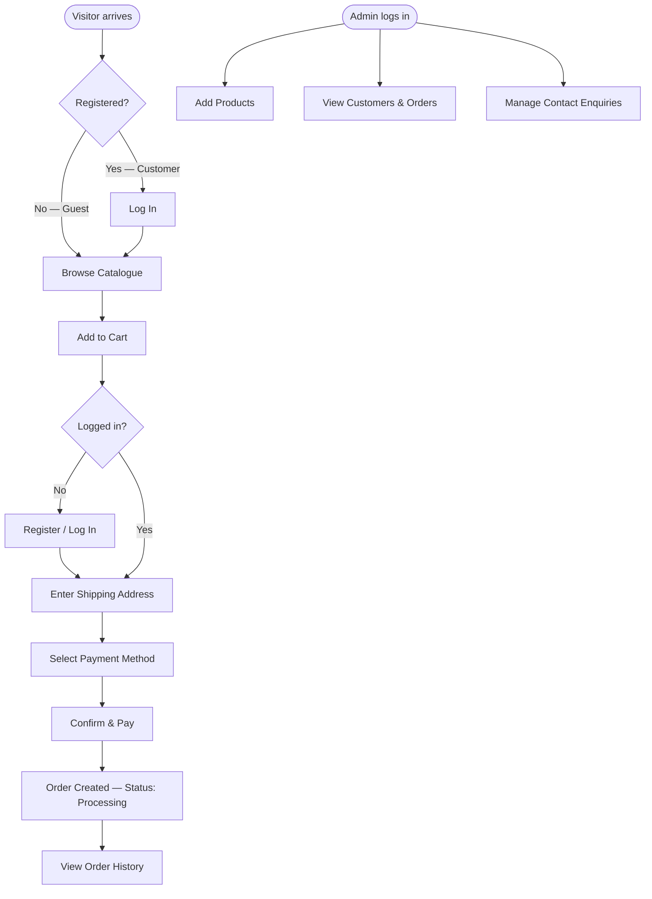

# Business System Overview — EcommerceApp

**Document ID:** BO-001  
**Version:** 1.0  
**Phase:** Business Documentation  
**Source Module:** ECOMMERCE_APPLICATION

---

## Purpose

EcommerceApp is an online electronic retail platform that enables customers to browse, select, and purchase electronic products across four categories (mobiles, TVs, laptops, and watches). It provides separate experiences for three types of users — guests, registered customers, and administrators — and supports the full e-commerce lifecycle from product discovery to order placement.

---

## Business Context

The system serves a small-to-medium electronics retailer operating in the Indian market (prices in Indian Rupees ₹). It supports a direct-to-consumer sales model where:

- **Customers** discover and purchase products online without visiting a physical store.
- **Administrators** manage the product catalogue and monitor customer and order data.
- **Guests** can browse and even add items to a cart, converting to registered customers at checkout.

---

## Actors

| Actor | Description | Authentication |
|---|---|---|
| **Guest** | Anonymous visitor. Can browse the product catalogue, add items to a shared guest cart, and submit contact enquiries. Must register or log in to place an order. | None |
| **Customer** | Registered and logged-in user. Can browse, manage a personal cart, place orders, view order history, and cancel orders. | Persistent cookie (`cname` = email) |
| **Admin** | Internal staff user. Can add products, view all customer and order data, manage the cart/order tables, delete customers, and remove contact enquiries. | Persistent cookie (`tname` = username) |

---

## Business Domains

| Domain | Summary |
|---|---|
| **Authentication & Registration** | Customers register with name, email, password, and phone; log in via email + password. Admins log in via username + password. Identity is maintained via browser cookies. |
| **Product Catalogue** | Admin adds products with name, price, quantity, brand, category, and an image. Products are displayed in a viewlist and organised by category (mobile, TV, laptop, watch). |
| **Shopping Cart** | Guests and customers add products to a cart. Guests share a single anonymous cart; each customer has a named cart keyed on their email address. Quantities are incremented for duplicate items. |
| **Checkout & Order Management** | Customers provide a shipping address and choose a payment method (cash or online). The system creates an order record, copies cart items to order details, clears the cart, and marks the order as "Processing". |
| **Admin Operations** | Admins can view raw database tables (cart, orders, order_details, contact enquiries), delete rows, delete customers, and view a dashboard of featured products. |
| **Customer Support** | Guests and customers can submit contact enquiries (name, email, phone, message). Admins can view and delete these enquiries. |

---

## High-Level Business Flow

---

## Key Business Rules

| Rule ID | Rule |
|---|---|
| BR-001 | A customer's name and email must each be unique across all registered accounts. |
| BR-002 | Products must belong to exactly one brand and one category. |
| BR-003 | Only image files (.jpg, .bmp, .jpeg, .png, .webp) not exceeding 10 MB may be uploaded as product images. |
| BR-004 | An order can only be placed if the cart contains at least one item. |
| BR-005 | All newly created orders are assigned a status of "Processing". |
| BR-006 | Guests may add items to a shared cart; their cart is converted to an order at checkout. |
| BR-007 | Customers may cancel their own orders at any time; this removes the order header but not the order detail lines. |
| BR-008 | Admins may delete any customer account; this does not cascade to cart or order records. |
| BR-009 | Contact enquiries are stored indefinitely until an admin explicitly removes them. |
| BR-010 | Only one payment method may be selected per order: cash on delivery or online payment. |

---

## Product Categories & Brands

**Categories (4):** Mobile, TV, Laptop, Watch  
**Brands (5):** Samsung, Sony, Lenovo, Acer, Onida

---

## Related Artifacts

| Artifact | Location |
|---|---|
| Discovered Flows | `docs/discovered-flows.md` |
| Domain Concepts | `docs/discovered-domain-concepts.md` |
| Components | `docs/discovered-components.md` |
| Business Use Cases | `docs/business/use-cases/` |
| Business Processes | `docs/business/processes/` |
| Business Index | `docs/business/index.md` |
