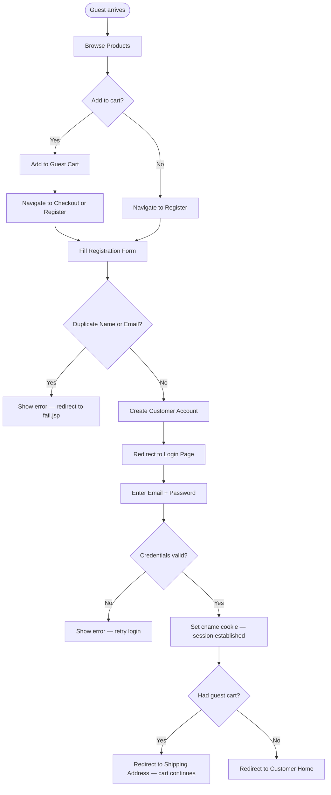

# BP-001: Customer Onboarding

**Process ID:** BP-001  
**Name:** Customer Onboarding  
**Version:** 1.0  
**Related Use Cases:** UC-001 (Register), UC-002 (Login)  
**Related Flows:** FL-001, FL-002

---

## Purpose
Bring a new visitor from anonymous guest status to an authenticated, registered customer capable of placing orders.

## Scope
This process covers the complete journey from first visit through registration and first login, including the seamless cart-continuation path where a guest who has already added items to a cart proceeds directly to checkout after registering and logging in.

## Actors
- **Guest** — initiates the process
- **System** — validates and persists registration data, manages session cookies

## Process Steps

| Step | Description | Actor | Outcome |
|---|---|---|---|
| 1 | Guest visits the platform and browses products | Guest | Awareness of product catalogue |
| 2 | Guest optionally adds items to the guest cart | Guest | Cart populated with anonymous items |
| 3 | Guest navigates to the registration page | Guest | Registration form displayed |
| 4 | Guest submits registration form (name, email, password, phone) | Guest | Form data sent to system |
| 5 | System checks for duplicate name or email | System | Uniqueness confirmed or rejected |
| 6 | System creates customer account | System | Account persisted in `customer` table |
| 7 | System redirects to login page (with cart context if applicable) | System | Login page displayed |
| 8 | Guest (now registered) submits login form | Customer | Credentials submitted |
| 9 | System validates credentials | System | Match found or rejected |
| 10 | System sets persistent session cookie (`cname` = email) | System | Customer session established |
| 11a | If guest had cart items → redirect to shipping address | System | Checkout continues seamlessly |
| 11b | If no prior cart → redirect to customer home | System | Customer can browse and shop |

## Process Diagram

## Business Rules
- BR-001: Name and email must be unique across all customer accounts.
- Cookie `cname` is set to the customer's email address and persists for ~2.7 hours × 3600 (maxAge=9999 seconds ≈ 2.78 hours).
- The guest cart (identified by NULL name) carries forward to the checkout — there is no merge with a named cart.

## Key Performance Indicators
- Registration completion rate (registrations ÷ registration form views)
- Login success rate
- Cart-continuation completion rate (checkouts initiated by post-registration logins)
