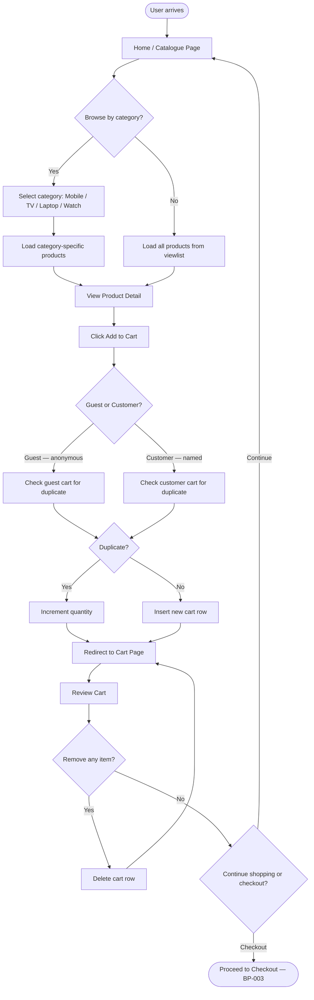

# BP-002: Product Discovery and Shopping

**Process ID:** BP-002  
**Name:** Product Discovery and Shopping  
**Version:** 1.0  
**Related Use Cases:** UC-004 (Browse Catalogue), UC-005 (Add to Cart), UC-006 (Manage Cart)  
**Related Flows:** FL-005, FL-006, FL-007, FL-008, FL-010, FL-011

---

## Purpose
Enable any user (guest, customer) to discover products, explore categories, and build a shopping cart in preparation for checkout.

## Scope
Covers all browsing and cart management activities: viewing the product catalogue, filtering by category, viewing product details, adding to cart, and removing items.

## Actors
- **Guest** — browses and builds an anonymous cart
- **Customer** — browses and builds a personalised cart
- **System** — retrieves product data, manages cart state

## Process Steps

| Step | Description | Actor | Outcome |
|---|---|---|---|
| 1 | User visits the home page or navigates to a category | Guest / Customer | Product listings displayed |
| 2 | User filters by category (optional): Mobile, TV, Laptop, Watch | User | Category-specific products displayed |
| 3 | User selects a product for detail view | User | Product detail page rendered |
| 4 | User clicks "Add to Cart" | User | Cart update initiated |
| 5 | System checks if the same product is already in the cart | System | Duplicate check performed |
| 6a | If duplicate: system increments quantity by 1 | System | Quantity updated in cart |
| 6b | If new: system inserts a new cart row | System | Cart row added |
| 7 | User is redirected to the cart page | System | Cart contents displayed |
| 8 | User reviews cart items | User | Items visible with price and quantity |
| 9 | User optionally removes unwanted items | User | Remove action triggered |
| 10 | System deletes the cart row | System | Item removed from cart |
| 11 | User proceeds to checkout or continues browsing | User | Next action taken |

## Process Diagram

## Business Rules
- Guest cart uses a NULL customer name; all guest items share the same anonymous cart.
- Duplicate check matches on: brand name, category name, product name, price, and image filename.
- Products are identified in the cart by their image filename (not a formal product ID).
- A cart has no expiry — items persist until removed or checkout clears them.
