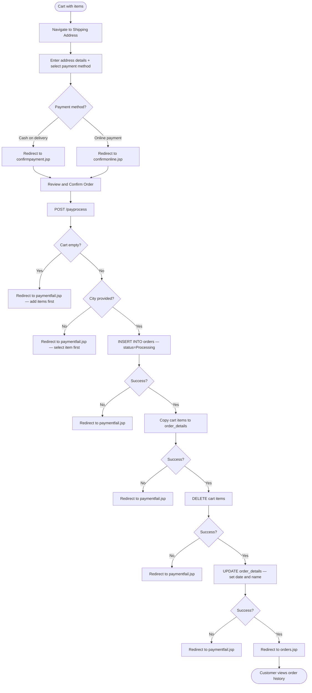

# BP-003: Checkout and Order Fulfilment

**Process ID:** BP-003  
**Name:** Checkout and Order Fulfilment  
**Version:** 1.0  
**Related Use Cases:** UC-007 (Checkout), UC-008 (View Orders), UC-009 (Cancel Order)  
**Related Flows:** FL-014, FL-015, FL-024, FL-025, FL-016

---

## Purpose
Guide a customer from a populated cart through address entry, payment method selection, and order confirmation to produce a persisted order record and clear the cart.

## Scope
Covers the full checkout journey including shipping address capture, payment method choice, order creation, and post-order management (viewing and cancelling orders).

## Actors
- **Customer / Guest** — drives the checkout process
- **System** — validates, creates order records, and manages data state transitions

## Process Steps

| Step | Description | Actor | Outcome |
|---|---|---|---|
| 1 | Customer navigates from cart to shipping address form | Customer | Shipping address form displayed |
| 2 | Customer enters shipping details (name, address, city, etc.) | Customer | Form data captured |
| 3 | Customer selects payment method (cash or online) | Customer | Payment choice made |
| 4 | Customer submits shipping form | Customer | Form submitted to system |
| 5 | System routes to appropriate payment confirmation page | System | Confirmation page displayed |
| 6 | Customer reviews and confirms order | Customer | Final confirmation submitted |
| 7 | System validates cart is not empty and city is provided | System | Validation passes or fails |
| 8 | System inserts a new order record (status = "Processing") | System | Order header created |
| 9 | System copies cart items to order details | System | Order line items created |
| 10 | System deletes all cart items | System | Cart cleared |
| 11 | System updates order details with date and customer name | System | Order details finalised |
| 12 | System redirects to the order history page | System | Order visible in history |

## Post-Order Management

| Step | Description | Actor | Outcome |
|---|---|---|---|
| 13 | Customer views order list with status and total | Customer | Order history displayed |
| 14 | Customer drills into order detail to see line items | Customer | Item breakdown visible |
| 15 | Customer optionally cancels an order | Customer | Order header deleted |

## Process Diagram

## Business Rules
- Order status at creation is always **"Processing"** — no subsequent status transitions are supported in the current system.
- Payment selection routes to different confirmation pages but uses the same order creation logic.
- The four-step order creation (insert order → copy cart → delete cart → update details) is not wrapped in a database transaction. A failure at any step may leave partial records.
- Guest checkout uses a NULL-name cart; the guest must be logged in (having registered) before reaching the shipping address step.

## Key Performance Indicators
- Checkout completion rate (orders placed ÷ shipping address page views)
- Payment failure rate by reason (empty cart vs. system error)
- Average order value (Total_Price)
