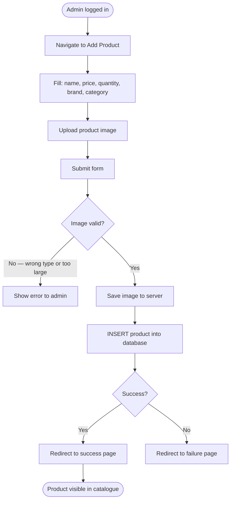

# BP-004: Admin Product Management

**Process ID:** BP-004  
**Name:** Admin Product Management  
**Version:** 1.0  
**Related Use Cases:** UC-011 (Add Product), UC-014 (Admin Dashboard)  
**Related Flows:** FL-004, FL-026

---

## Purpose
Allow administrators to add new products to the catalogue so they become available for customers and guests to browse and purchase.

## Scope
Covers the process of an admin creating a product record with all required attributes (name, price, quantity, brand, category, image), and the resulting catalogue update visible to all users.

## Actors
- **Admin** — creates product entries
- **System** — validates image, persists product record, makes product available in catalogue

## Process Steps

| Step | Description | Actor | Outcome |
|---|---|---|---|
| 1 | Admin logs in and accesses the admin dashboard | Admin | Dashboard visible |
| 2 | Admin navigates to "Add Product" | Admin | Product form displayed |
| 3 | Admin enters: product name, price, stock quantity | Admin | Core attributes captured |
| 4 | Admin selects brand (Samsung, Sony, Lenovo, Acer, Onida) | Admin | Brand ID resolved |
| 5 | Admin selects category (Mobile, TV, Laptop, Watch) | Admin | Category ID resolved |
| 6 | Admin uploads product image | Admin | Image file selected |
| 7 | Admin submits the form | Admin | Multipart form submitted |
| 8 | System validates image (type: .jpg/.bmp/.jpeg/.png/.webp; size ≤ 10 MB) | System | Validation passed or rejected |
| 9 | System saves image to the server images directory | System | Image file stored |
| 10 | System inserts product record into database | System | Product persisted |
| 11 | System redirects admin to a success page | System | Confirmation displayed |
| 12 | Product is now visible in the catalogue for all users | System | Catalogue updated |

## Process Diagram

## Business Rules
- Allowed image formats: `.jpg`, `.bmp`, `.jpeg`, `.png`, `.webp`.
- Maximum image size: 10 MB.
- Brand and category are selected from fixed lists; the mapping to IDs is hardcoded (brand: Samsung=1, Sony=2, Lenovo=3, Acer=4, Onida=5; category: Laptop=1, TV=2, Mobile=3, Watch=4).
- There is no product edit or delete feature — once added, a product cannot be modified or removed through the UI.
- The image filename is used as a surrogate identifier for the product in cart and order detail records.
