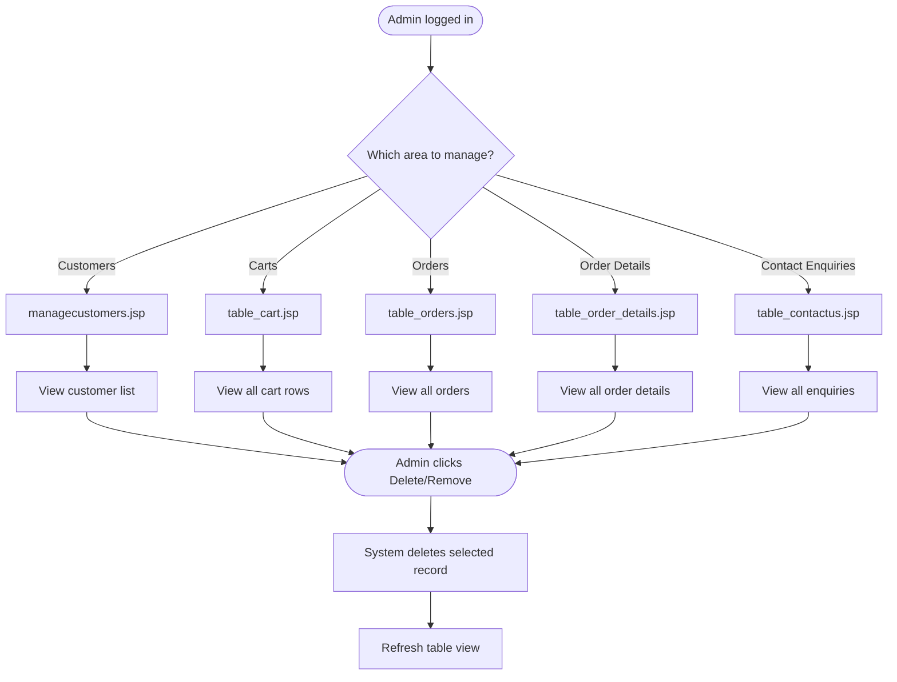

# BP-005: Admin Customer and Data Management

**Process ID:** BP-005  
**Name:** Admin Customer and Data Management  
**Version:** 1.0  
**Related Use Cases:** UC-012 (Manage Customers), UC-013 (Manage Enquiries)  
**Related Flows:** FL-020, FL-021, FL-022, FL-023, FL-017

---

## Purpose
Provide administrators with visibility into all platform data (customers, carts, orders, contact enquiries) and the ability to remove records as needed.

## Scope
Covers all administrative data management activities: viewing and deleting customer accounts, managing the cart table, managing order and order detail records, and reviewing and removing contact enquiries.

## Actors
- **Admin** — reviews data and triggers deletions
- **System** — retrieves records and performs deletions

## Process Steps

| Step | Description | Actor | Outcome |
|---|---|---|---|
| 1 | Admin logs in and accesses the admin dashboard | Admin | Admin dashboard visible |
| 2 | Admin navigates to the desired data table view | Admin | Appropriate table page loaded |
| 3 | System retrieves all records for the selected table | System | Records displayed |
| 4 | Admin reviews records | Admin | Records understood |
| 5 | Admin clicks "Delete" or "Remove" on a specific record | Admin | Delete action triggered |
| 6 | System deletes the selected record | System | Record removed |
| 7 | System refreshes the table view | System | Updated list displayed |

## Data Management Areas

| Area | Page | Admin Actions |
|---|---|---|
| Customers | `managecustomers.jsp` | View all, delete by name + email |
| Shopping Carts | `table_cart.jsp` | View all carts (guest + customer), remove cart rows |
| Orders | `table_orders.jsp` | View all orders, remove order by ID |
| Order Details | `table_order_details.jsp` | View all order detail lines, remove by date + image |
| Contact Enquiries | `table_contactus.jsp` | View all enquiries, remove by ID |

## Process Diagram

## Business Rules
- Deleting a customer does not cascade to their cart items or order records — these must be removed separately if needed.
- Deleting an order from the orders table does not cascade to the order_details table.
- Cart removal handles both guest (NULL name) and customer-named rows through the same admin interface.
- All admin operations are irreversible — there is no soft-delete or undo capability.
