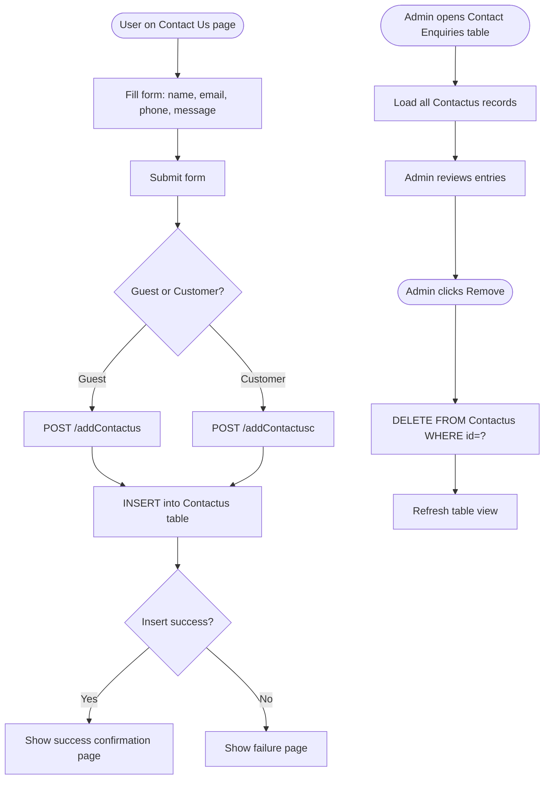

# BP-006: Customer Support — Contact Enquiry Handling

**Process ID:** BP-006  
**Name:** Customer Support — Contact Enquiry Handling  
**Version:** 1.0  
**Related Use Cases:** UC-010 (Submit Enquiry), UC-013 (Admin Manage Enquiries)  
**Related Flows:** FL-018, FL-019, FL-021

---

## Purpose
Provide a communication channel for guests and customers to submit enquiries to the business, and enable administrators to review and resolve those enquiries.

## Scope
Covers enquiry submission by users (guest and customer paths), storage in the system, admin review, and eventual removal of resolved or unwanted entries.

## Actors
- **Guest** — submits a contact enquiry without logging in
- **Customer** — submits a contact enquiry while logged in
- **Admin** — reviews submitted enquiries and removes resolved ones
- **System** — persists enquiries and provides admin visibility

## Process Steps

| Step | Description | Actor | Outcome |
|---|---|---|---|
| 1 | User (guest or customer) navigates to the "Contact Us" page | Guest / Customer | Contact form displayed |
| 2 | User fills in: name, email address, contact number, and message | User | Form data entered |
| 3 | User submits the form | User | Form submitted to system |
| 4 | System saves the enquiry to the database | System | Enquiry record created |
| 5 | System shows a confirmation page (success or failure) | System | User informed of outcome |
| 6 | Admin navigates to the contact enquiries table | Admin | All enquiries listed |
| 7 | Admin reviews enquiry content | Admin | Enquiry understood |
| 8 | Admin removes resolved or spam enquiries | Admin | Delete triggered |
| 9 | System removes the enquiry record | System | Record deleted |
| 10 | Admin table view refreshes | System | Updated list displayed |

## Process Diagram

## Business Rules
- No email notification or escalation is sent when an enquiry is received — it is only visible in the admin interface.
- Enquiries are stored indefinitely until an admin removes them; there is no auto-expiry.
- Both guest and customer enquiry submissions write to the same `Contactus` table.
- There is no ability to reply to enquiries from within the system.
