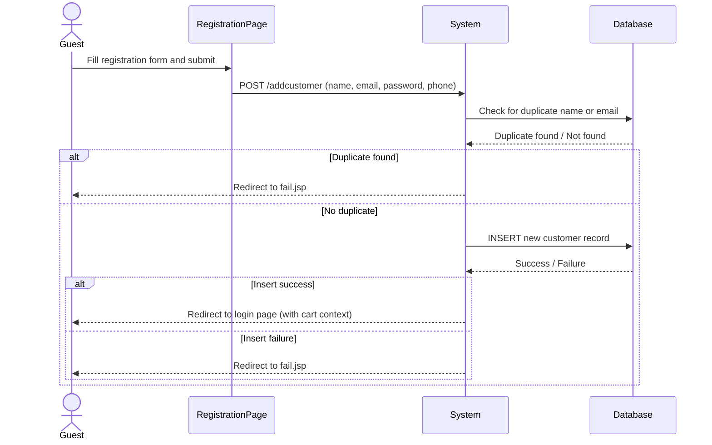

# UC-001: Register as Customer

**Use Case ID:** UC-001  
**Name:** Register as Customer  
**Version:** 1.0  
**Related Flows:** FL-001  
**Related Domain Concepts:** DC-004 (Customer)

---

## Description
A guest visitor creates a new customer account so that they can place orders and access personalised shopping features.

## Actors
| Actor | Role |
|---|---|
| **Guest** | Primary actor — initiates registration |
| **System** | Validates inputs, checks uniqueness, persists account |

## Preconditions
- The visitor does not already have a registered account.
- The visitor has access to the registration page (`customer_reg.jsp`).

## Postconditions
- A new customer record exists in the system.
- The customer is redirected to the login page with a success indicator.

## Business Requirements

| BUREQ ID | Requirement |
|---|---|
| BUREQ-001-01 | The system must prevent duplicate registrations based on name or email address. |
| BUREQ-001-02 | The system must collect: full name, password, email address, and contact number. |
| BUREQ-001-03 | Upon successful registration, the customer must be directed to the login flow without needing to re-enter their credentials. |
| BUREQ-001-04 | If registration fails (duplicate or system error), the customer must be shown a clear failure message. |

## Main Flow

| Step | Actor | Action |
|---|---|---|
| 1 | Guest | Navigates to the registration page. |
| 2 | Guest | Enters name, password, email, and contact number, then submits the form. |
| 3 | System | Validates that neither the name nor the email already exists in the customer database. |
| 4 | System | Creates the customer account. |
| 5 | System | Redirects the guest to the login page, passing along any pending cart information. |

## Alternative Flows

### AF-001-A: Duplicate Name or Email
- At Step 3, if the name or email already exists, the system redirects to a failure page.
- The guest must return and re-enter different credentials.

### AF-001-B: Database Error
- At Step 4, if the insert fails, the system redirects to a failure page.

## Sequence Diagram

