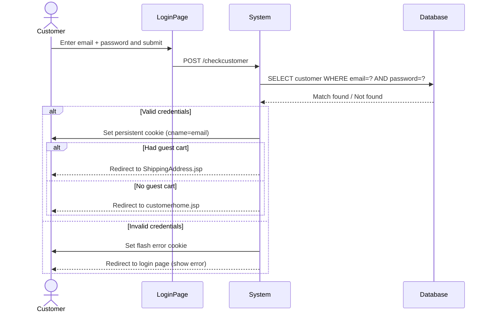

# UC-002: Customer Login

**Use Case ID:** UC-002  
**Name:** Customer Login  
**Version:** 1.0  
**Related Flows:** FL-002  
**Related Domain Concepts:** DC-004 (Customer)

---

## Description
A registered customer authenticates with their email address and password to access personalised shopping features and complete checkout.

## Actors
| Actor | Role |
|---|---|
| **Customer / Guest** | Primary actor — provides credentials |
| **System** | Validates credentials, establishes session via cookie |

## Preconditions
- The customer has a registered account.
- The customer is on the login page (`customerlogin.jsp`).

## Postconditions
- A persistent session cookie (`cname` = email) is set in the customer's browser.
- The customer is redirected to their home page or directly to the shipping address step if they had an active guest cart.

## Business Requirements

| BUREQ ID | Requirement |
|---|---|
| BUREQ-002-01 | The system must authenticate customers using email address and password. |
| BUREQ-002-02 | On successful login, the system must establish a persistent session valid across browser sessions. |
| BUREQ-002-03 | If a guest had items in their cart before logging in, those items must be preserved and the checkout flow must continue. |
| BUREQ-002-04 | On failed login, the customer must be shown an error and allowed to retry. |

## Main Flow

| Step | Actor | Action |
|---|---|---|
| 1 | Customer | Navigates to the login page. |
| 2 | Customer | Enters email address and password, then submits. |
| 3 | System | Validates credentials against the customer database. |
| 4 | System | Sets a persistent session cookie (`cname` = email). |
| 5 | System | Redirects to the customer home page. |

## Alternative Flows

### AF-002-A: Guest Cart Continuation
- At Step 5, if the customer had an active guest cart (cart-continuation flag present), the system redirects to the shipping address page instead of the home page.

### AF-002-B: Invalid Credentials
- At Step 3, if credentials do not match, the system sets a flash error cookie and redirects back to the login page with an error message.

## Sequence Diagram

