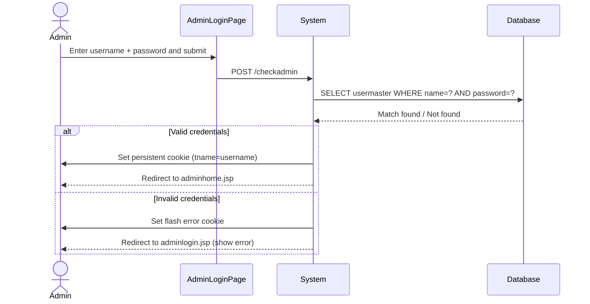

# UC-003: Admin Login

**Use Case ID:** UC-003  
**Name:** Admin Login  
**Version:** 1.0  
**Related Flows:** FL-003  
**Related Domain Concepts:** DC-005 (UserMaster/Admin)

---

## Description
An internal administrator authenticates with their username and password to access the admin section of the platform.

## Actors
| Actor | Role |
|---|---|
| **Admin** | Primary actor — provides admin credentials |
| **System** | Validates credentials, establishes admin session via cookie |

## Preconditions
- The admin has a pre-seeded account in the `usermaster` table.
- The admin navigates to the admin login page (`adminlogin.jsp`).

## Postconditions
- A persistent admin session cookie (`tname` = username) is set.
- The admin is redirected to the admin dashboard (`adminhome.jsp`).

## Business Requirements

| BUREQ ID | Requirement |
|---|---|
| BUREQ-003-01 | The system must authenticate admins using username and password. |
| BUREQ-003-02 | On successful login, an admin session must be established via a persistent cookie. |
| BUREQ-003-03 | On failed login, the admin must receive an error message and be allowed to retry. |

## Main Flow

| Step | Actor | Action |
|---|---|---|
| 1 | Admin | Navigates to the admin login page. |
| 2 | Admin | Enters username and password, then submits. |
| 3 | System | Validates credentials against the admin user table. |
| 4 | System | Sets a persistent session cookie (`tname` = username). |
| 5 | System | Redirects the admin to the admin dashboard. |

## Alternative Flows

### AF-003-A: Invalid Credentials
- At Step 3, if credentials do not match, the system sets a flash error cookie and redirects back to the admin login page.

## Sequence Diagram

