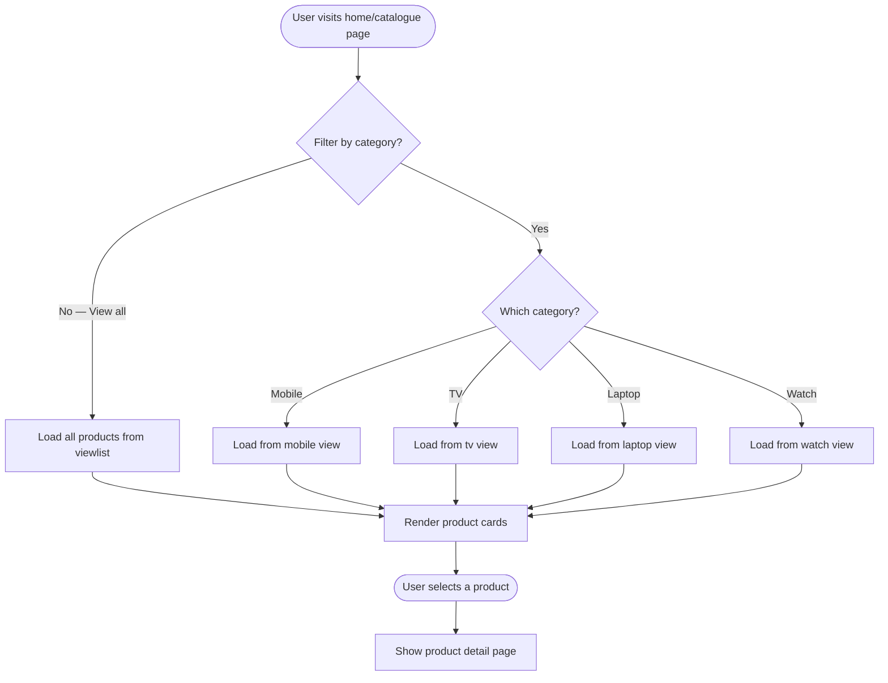

# UC-004: Browse Product Catalogue

**Use Case ID:** UC-004  
**Name:** Browse Product Catalogue  
**Version:** 1.0  
**Related Flows:** FL-005, FL-006, FL-026, FL-027  
**Related Domain Concepts:** DC-001 (Product), DC-002 (Brand), DC-003 (Category)

---

## Description
Any user (guest, customer, or admin) can browse the full product catalogue or drill into a specific product category to discover available electronics.

## Actors
| Actor | Role |
|---|---|
| **Guest** | Can browse freely without logging in |
| **Customer** | Can browse and access personalised features |
| **Admin** | Can browse to review what is listed |
| **System** | Retrieves and displays product information |

## Preconditions
- Products have been added to the catalogue by an admin.
- The user is on any home or catalogue page.

## Postconditions
- The user can see product listings with image, name, price, brand, and category.
- The user can navigate to a product detail page or add a product to their cart.

## Business Requirements

| BUREQ ID | Requirement |
|---|---|
| BUREQ-004-01 | The system must display all available products with their name, price, image, brand, and category. |
| BUREQ-004-02 | The system must allow users to filter products by category (mobile, TV, laptop, watch). |
| BUREQ-004-03 | Each category must present a consistent browsing experience regardless of whether the user is a guest, customer, or admin. |
| BUREQ-004-04 | Users must be able to navigate from a product listing to a product detail view. |

## Main Flow

| Step | Actor | Action |
|---|---|---|
| 1 | User | Arrives at the home page or navigates to a category from the navigation bar. |
| 2 | System | Retrieves all products from the product view (or the category-specific view). |
| 3 | System | Renders product cards showing image, name, price, and brand. |
| 4 | User | Selects a product to view its detail page. |
| 5 | System | Displays the full product detail, including quantity available and category. |

## Alternative Flows

### AF-004-A: Browse by Category
- At Step 1, the user selects a specific category (e.g., "Mobile") from the navigation bar.
- At Step 2, the system retrieves only products in that category from the corresponding category view.

### AF-004-B: No Products Available
- At Step 2, if no products exist in the catalogue (or category), the system displays an empty state.

## Diagram

