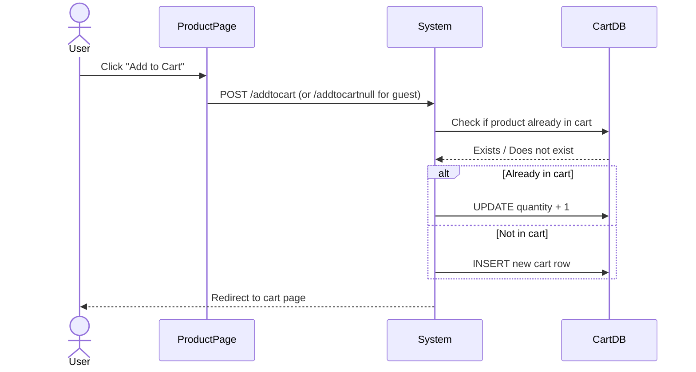
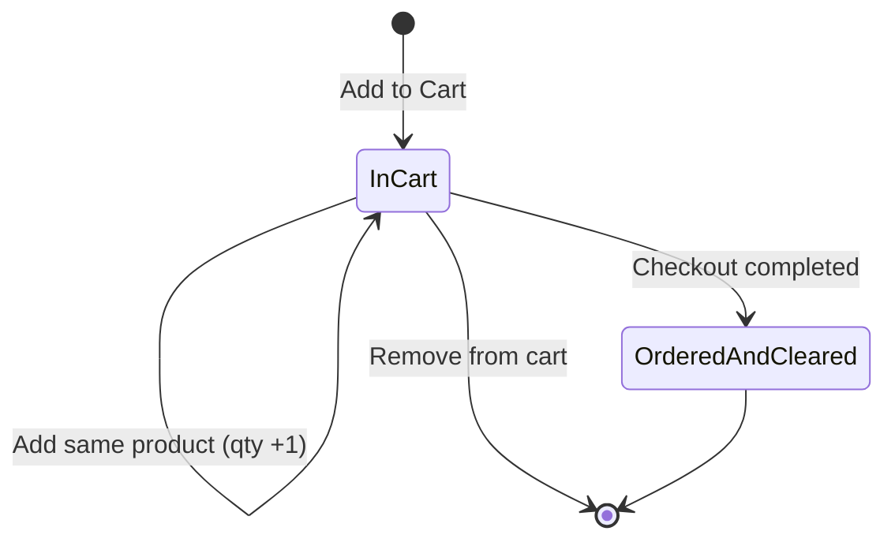

# UC-005: Add Product to Cart

**Use Case ID:** UC-005  
**Name:** Add Product to Cart  
**Version:** 1.0  
**Related Flows:** FL-007, FL-008, FL-009  
**Related Domain Concepts:** DC-001 (Product), DC-006 (Cart), DC-004 (Customer)

---

## Description
A guest or registered customer selects a product and adds it to their shopping cart. The system supports both anonymous (guest) carts and personalised (customer) carts.

## Actors
| Actor | Role |
|---|---|
| **Guest** | Can add items to a shared anonymous cart |
| **Customer** | Can add items to their personal named cart |
| **Admin** | Can view the cart pages but cannot add items through normal flows |
| **System** | Checks for existing items, increments quantity or adds new cart row |

## Preconditions
- At least one product exists in the product catalogue.
- The user is viewing a product detail page.

## Postconditions
- The product appears in the user's cart (anonymous or named).
- If the product was already in the cart, its quantity is incremented by 1.
- The user is redirected to their cart view.

## Business Requirements

| BUREQ ID | Requirement |
|---|---|
| BUREQ-005-01 | The system must allow guests to add products to an anonymous cart without requiring login. |
| BUREQ-005-02 | The system must allow registered customers to add products to their personal cart. |
| BUREQ-005-03 | If an identical product is already in the cart, the system must increment its quantity rather than adding a duplicate row. |
| BUREQ-005-04 | The cart must store product name, brand, category, price, quantity, and image reference. |

## Main Flow (Authenticated Customer)

| Step | Actor | Action |
|---|---|---|
| 1 | Customer | Views a product detail page and clicks "Add to Cart". |
| 2 | System | Checks whether the product is already in the customer's named cart. |
| 3a | System | If already present: increments the product quantity by 1. |
| 3b | System | If not present: creates a new cart row linked to the customer's email. |
| 4 | System | Redirects the customer to their cart view. |

## Alternative Flow: Guest Cart

| Step | Actor | Action |
|---|---|---|
| 1 | Guest | Views a product detail page and clicks "Add to Cart". |
| 2 | System | Checks whether the product is already in the anonymous (null-name) cart. |
| 3a | System | If already present: increments the product quantity by 1. |
| 3b | System | If not present: creates a new cart row with no customer name. |
| 4 | System | Redirects the guest to the anonymous cart view. |

## Sequence Diagram

## State Diagram: Cart Item

