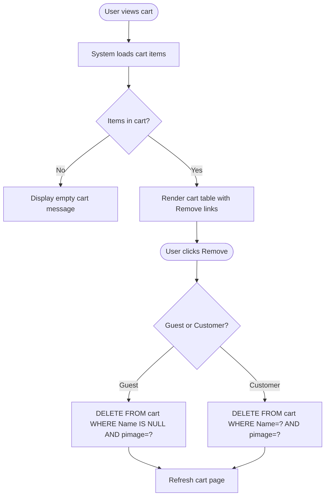

# UC-006: Manage Shopping Cart

**Use Case ID:** UC-006  
**Name:** Manage Shopping Cart  
**Version:** 1.0  
**Related Flows:** FL-010, FL-011, FL-012, FL-013  
**Related Domain Concepts:** DC-006 (Cart)

---

## Description
A guest or registered customer can view the contents of their shopping cart and remove items they no longer wish to purchase.

## Actors
| Actor | Role |
|---|---|
| **Guest** | Can view and remove items from the anonymous cart |
| **Customer** | Can view and remove items from their personal cart |
| **Admin** | Can view and remove any cart item via the admin table management view |
| **System** | Retrieves cart data and performs deletions |

## Preconditions
- The user has at least one item in their cart.

## Postconditions
- The selected cart item is permanently removed from the cart.
- The cart view refreshes to reflect the updated contents.

## Business Requirements

| BUREQ ID | Requirement |
|---|---|
| BUREQ-006-01 | The system must display all items currently in the user's cart, including product name, category, brand, price, and quantity. |
| BUREQ-006-02 | The system must allow users to remove any item from their cart. |
| BUREQ-006-03 | Removing an item must immediately update the cart display without requiring a page reload. |
| BUREQ-006-04 | An admin must be able to remove any cart item from any cart (guest or customer) via the admin interface. |

## Main Flow

| Step | Actor | Action |
|---|---|---|
| 1 | User | Navigates to the cart page. |
| 2 | System | Retrieves all cart items for the current user (by email for customer, by null name for guest). |
| 3 | System | Displays cart items with name, brand, category, price, and quantity. |
| 4 | User | Clicks the "Remove" link next to an item. |
| 5 | System | Deletes the corresponding cart row. |
| 6 | System | Refreshes the cart page. |

## Alternative Flows

### AF-006-A: Admin Removes a Cart Item
- Admin navigates to the admin cart table view.
- Admin clicks "Remove" next to any cart row (guest or customer).
- System removes the row and refreshes the admin table view.

### AF-006-B: Empty Cart
- At Step 2, if no items are in the cart, the cart page displays an empty state.

## Diagram

