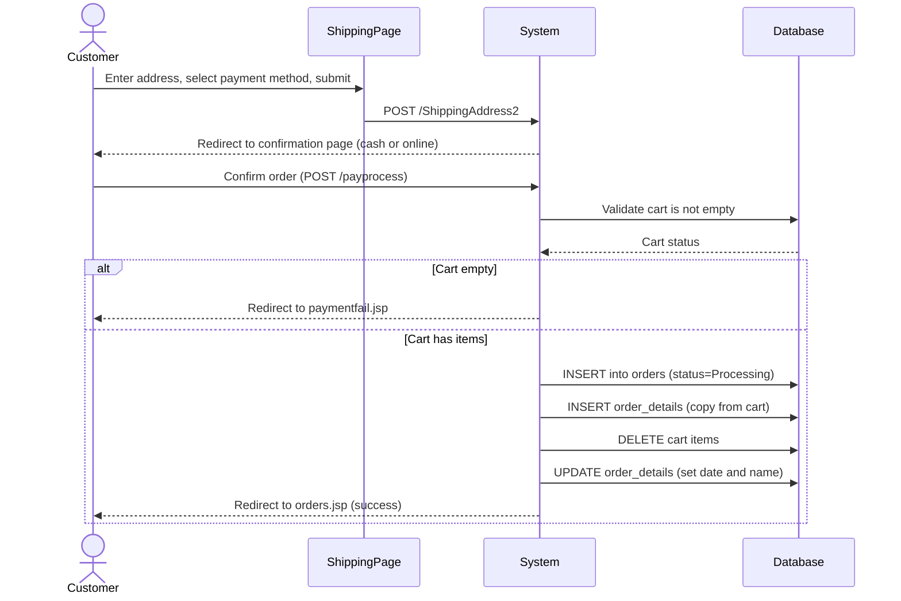
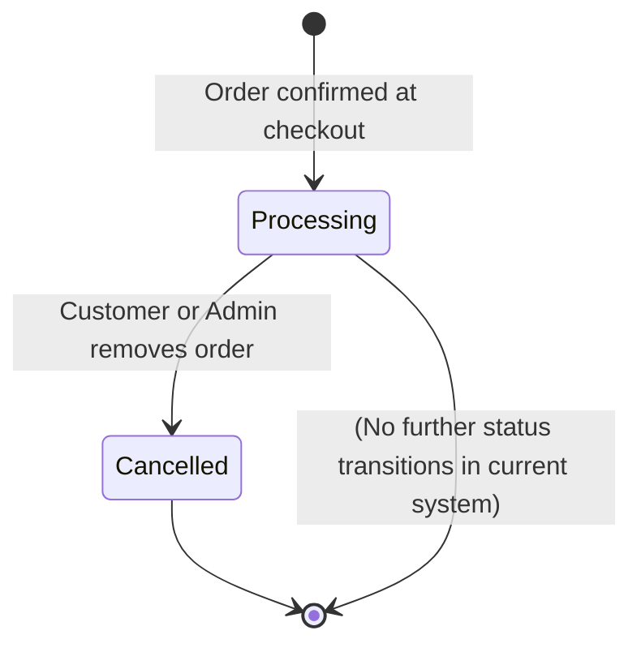

# UC-007: Checkout and Place Order

**Use Case ID:** UC-007  
**Name:** Checkout and Place Order  
**Version:** 1.0  
**Related Flows:** FL-014, FL-015  
**Related Domain Concepts:** DC-007 (Orders), DC-008 (OrderDetails), DC-006 (Cart), DC-004 (Customer)

---

## Description
A customer (registered or guest) enters their shipping address, selects a payment method, and confirms the order. The system creates an order record, transfers cart items to order details, and clears the cart.

## Actors
| Actor | Role |
|---|---|
| **Customer** | Primary actor — provides shipping address and payment method |
| **Guest** | Can complete checkout; guest cart is used as the order source |
| **System** | Validates cart, creates order, transfers items, clears cart |

## Preconditions
- The customer or guest has at least one item in their cart.
- A guest must have logged in or registered before reaching the shipping address step.

## Postconditions
- A new order record exists with status "Processing".
- All cart items have been transferred to order details linked to the new order.
- The cart is empty.
- The customer can view the order in their order history.

## Business Requirements

| BUREQ ID | Requirement |
|---|---|
| BUREQ-007-01 | The system must not allow checkout if the cart is empty. |
| BUREQ-007-02 | The customer must provide a city (minimum shipping location) to proceed. |
| BUREQ-007-03 | The customer must choose exactly one payment method: cash on delivery or online payment. |
| BUREQ-007-04 | On successful checkout, all cart items must be transferred to the order and the cart must be cleared. |
| BUREQ-007-05 | All new orders must be created with the status "Processing". |
| BUREQ-007-06 | If any step in the order creation process fails, the customer must be informed and no partial data must be silently left behind. |

## Main Flow

| Step | Actor | Action |
|---|---|---|
| 1 | Customer | Navigates to the shipping address page from the cart. |
| 2 | Customer | Enters shipping details (name, address, city, state, country, postcode). |
| 3 | Customer | Selects a payment method (cash on delivery or online payment). |
| 4 | Customer | Submits the shipping form. |
| 5 | System | Routes to the appropriate payment confirmation page. |
| 6 | Customer | Reviews and confirms the order. |
| 7 | System | Validates that the cart is not empty and the city is provided. |
| 8 | System | Creates an order record with status "Processing". |
| 9 | System | Copies all cart items to order details. |
| 10 | System | Deletes all cart items for this customer or guest. |
| 11 | System | Sets the date and customer name on the order details. |
| 12 | System | Redirects to the order history page. |

## Alternative Flows

### AF-007-A: Empty Cart
- At Step 7, if the cart is empty, the system redirects to the payment failure page with the message "Add items to cart first."

### AF-007-B: Missing City
- At Step 7, if the city field is not provided, the system redirects to the payment failure page with the message "Select any item first."

### AF-007-C: Database Error During Order Creation
- At Steps 8–11, if any database operation fails, the system redirects to the payment failure page. Note: partial data may remain in the database as no true transaction rollback is performed.

## Sequence Diagram

## Order Lifecycle State Diagram

