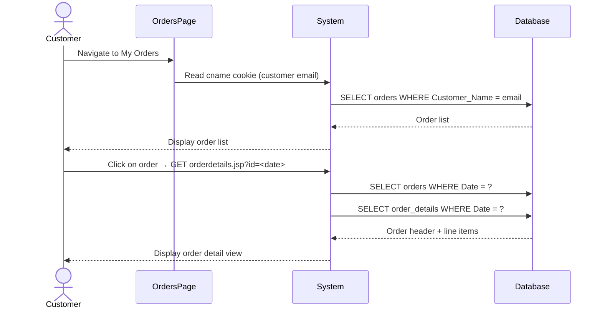

# UC-008: View Order History

**Use Case ID:** UC-008  
**Name:** View Order History  
**Version:** 1.0  
**Related Flows:** FL-024, FL-025  
**Related Domain Concepts:** DC-007 (Orders), DC-008 (OrderDetails)

---

## Description
A logged-in customer can view a list of all their past orders and drill into an individual order to see the full list of purchased items.

## Actors
| Actor | Role |
|---|---|
| **Customer** | Primary actor — views their personal order history |
| **System** | Retrieves and displays orders and order details |

## Preconditions
- The customer is logged in (session cookie `cname` is present).
- The customer has previously placed at least one order.

## Postconditions
- The customer has viewed their order summary list and/or the line items for a specific order.

## Business Requirements

| BUREQ ID | Requirement |
|---|---|
| BUREQ-008-01 | The system must display all orders placed by the currently logged-in customer. |
| BUREQ-008-02 | Each order in the list must show: order ID, city, date, total price, and status. |
| BUREQ-008-03 | The customer must be able to click on an order to view its individual line items (product name, brand, category, price, quantity). |

## Main Flow

| Step | Actor | Action |
|---|---|---|
| 1 | Customer | Navigates to the "My Orders" page. |
| 2 | System | Reads the session cookie to identify the customer (by email). |
| 3 | System | Retrieves all orders placed by this customer. |
| 4 | System | Renders the order list with summary columns. |
| 5 | Customer | Clicks on an order to view its details. |
| 6 | System | Retrieves order line items linked to the selected order's date. |
| 7 | System | Renders the order detail view with item-level breakdown and running total. |

## Alternative Flows

### AF-008-A: No Orders Found
- At Step 3, if no orders exist for the customer, the system displays an empty state on the orders page.

## Sequence Diagram

