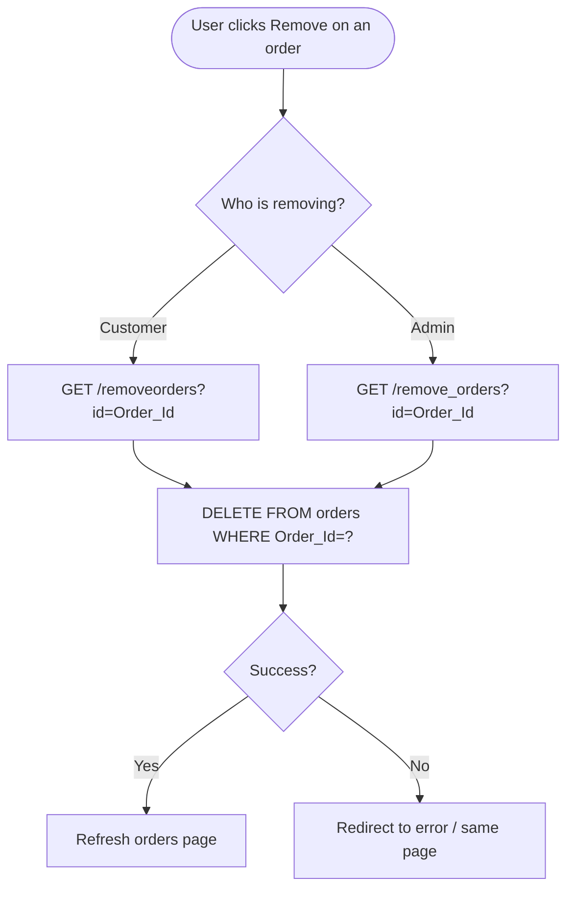

# UC-009: Cancel Order

**Use Case ID:** UC-009  
**Name:** Cancel Order  
**Version:** 1.0  
**Related Flows:** FL-016, FL-017  
**Related Domain Concepts:** DC-007 (Orders)

---

## Description
A customer can cancel (remove) an order from their order history. An admin can also remove any order from the admin order management view.

## Actors
| Actor | Role |
|---|---|
| **Customer** | Primary actor — cancels their own order |
| **Admin** | Secondary actor — can remove any order from the admin interface |
| **System** | Deletes the order record |

## Preconditions
- The order to be cancelled exists in the system.
- For a customer: the customer is on their orders page with the order visible.
- For an admin: the admin is on the admin order table view.

## Postconditions
- The order header record is deleted from the system.
- The order history page refreshes without the deleted order.

## Business Requirements

| BUREQ ID | Requirement |
|---|---|
| BUREQ-009-01 | Customers must be able to remove an order from their order history. |
| BUREQ-009-02 | Admins must be able to remove any order from the admin order management view. |
| BUREQ-009-03 | After cancellation, the orders page must refresh to reflect the change. |

## Main Flow (Customer)

| Step | Actor | Action |
|---|---|---|
| 1 | Customer | Navigates to the "My Orders" page. |
| 2 | Customer | Clicks the "Remove" link next to an order. |
| 3 | System | Deletes the order record by its order ID. |
| 4 | System | Refreshes the orders page. |

## Alternative Flow: Admin Cancels Order

| Step | Actor | Action |
|---|---|---|
| 1 | Admin | Navigates to the admin orders table view. |
| 2 | Admin | Clicks "Remove" next to any order. |
| 3 | System | Deletes the order record by its order ID. |
| 4 | System | Refreshes the admin order table page. |

> **Note:** Cancelling an order does not remove the associated order detail line items. This is a known limitation of the current system.

## Diagram

