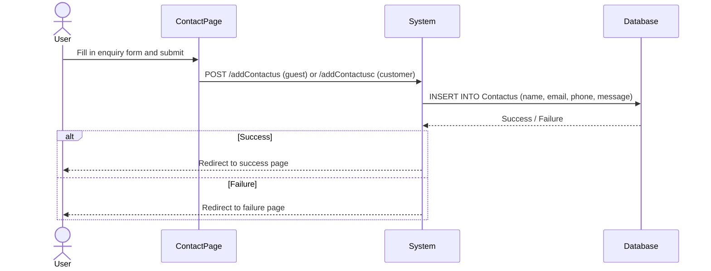

# UC-010: Submit Contact Enquiry

**Use Case ID:** UC-010  
**Name:** Submit Contact Enquiry  
**Version:** 1.0  
**Related Flows:** FL-018, FL-019  
**Related Domain Concepts:** DC-009 (ContactUs)

---

## Description
A guest or registered customer can submit a contact enquiry message to the business. The enquiry is stored in the system for admin review.

## Actors
| Actor | Role |
|---|---|
| **Guest** | Can submit an enquiry without logging in |
| **Customer** | Can submit an enquiry while logged in |
| **System** | Persists the enquiry and confirms submission |

## Preconditions
- The user is on the "Contact Us" page.

## Postconditions
- The enquiry (name, email, phone, message) is saved in the system.
- The user is shown a success or failure confirmation page.

## Business Requirements

| BUREQ ID | Requirement |
|---|---|
| BUREQ-010-01 | The system must allow both guests and registered customers to submit contact enquiries. |
| BUREQ-010-02 | Each enquiry must capture: full name, email address, contact number, and message. |
| BUREQ-010-03 | The system must confirm the submission outcome to the user (success or failure). |

## Main Flow

| Step | Actor | Action |
|---|---|---|
| 1 | User | Navigates to the "Contact Us" page. |
| 2 | User | Fills in name, email, phone, and message, then submits. |
| 3 | System | Saves the enquiry to the database. |
| 4 | System | Redirects to a confirmation page (success or failure). |

## Alternative Flows

### AF-010-A: Database Error
- At Step 3, if the insert fails, the system redirects to the failure page.

## Sequence Diagram

