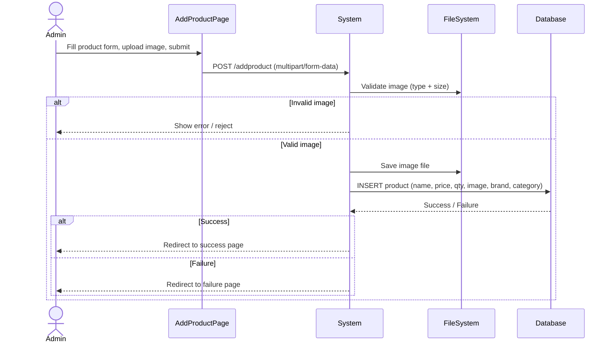

# UC-011: Admin Add Product

**Use Case ID:** UC-011  
**Name:** Admin Add Product  
**Version:** 1.0  
**Related Flows:** FL-004  
**Related Domain Concepts:** DC-001 (Product), DC-002 (Brand), DC-003 (Category)

---

## Description
An authenticated administrator adds a new product to the catalogue by providing its name, price, stock quantity, brand, category, and a product image.

## Actors
| Actor | Role |
|---|---|
| **Admin** | Primary actor — fills in and submits the product form |
| **System** | Validates the image, persists the product record |

## Preconditions
- The admin is authenticated (session cookie `tname` is present).
- The admin is on the "Add Product" page (`addproduct.jsp`).

## Postconditions
- A new product record is created in the catalogue.
- The product image is stored on the server.
- The product is immediately visible to all users in the catalogue.

## Business Requirements

| BUREQ ID | Requirement |
|---|---|
| BUREQ-011-01 | The system must only accept product images in .jpg, .bmp, .jpeg, .png, or .webp format and not exceeding 10 MB. |
| BUREQ-011-02 | Every product must be assigned to exactly one brand and one category. |
| BUREQ-011-03 | The system must confirm to the admin whether the product was successfully added. |
| BUREQ-011-04 | Only authenticated admins may add products. |

## Main Flow

| Step | Actor | Action |
|---|---|---|
| 1 | Admin | Navigates to the "Add Product" page. |
| 2 | Admin | Enters product name, price, quantity, selects brand and category, and uploads an image. |
| 3 | Admin | Submits the form. |
| 4 | System | Validates the uploaded image (file type and size). |
| 5 | System | Saves the image file to the server. |
| 6 | System | Inserts the product record into the database. |
| 7 | System | Redirects the admin to a success confirmation page. |

## Alternative Flows

### AF-011-A: Invalid Image File
- At Step 4, if the file type is not allowed or the file exceeds 10 MB, the upload is rejected and the admin is shown an error.

### AF-011-B: Database Insert Failure
- At Step 6, if the insert fails, the admin is redirected to a failure page.

## Sequence Diagram

