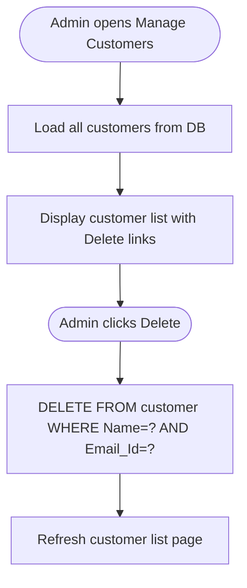

# UC-012: Admin Manage Customers

**Use Case ID:** UC-012  
**Name:** Admin Manage Customers  
**Version:** 1.0  
**Related Flows:** FL-020  
**Related Domain Concepts:** DC-004 (Customer)

---

## Description
An administrator views all registered customer accounts and may delete any customer from the system.

## Actors
| Actor | Role |
|---|---|
| **Admin** | Primary actor — views the customer list and performs deletions |
| **System** | Retrieves and presents customer data; performs deletion |

## Preconditions
- The admin is authenticated.
- The admin is on the "Manage Customers" page (`managecustomers.jsp`).

## Postconditions
- If deletion is triggered: the customer record is removed from the database.
- The customer list page refreshes.

## Business Requirements

| BUREQ ID | Requirement |
|---|---|
| BUREQ-012-01 | The admin must be able to view all registered customers with their name, email, and contact number. |
| BUREQ-012-02 | The admin must be able to permanently delete any customer account. |
| BUREQ-012-03 | After deletion, the customer list must reflect the removal. |

## Main Flow

| Step | Actor | Action |
|---|---|---|
| 1 | Admin | Navigates to the "Manage Customers" page. |
| 2 | System | Retrieves all customer records from the database. |
| 3 | System | Displays the customer list with name, email, and contact number. |
| 4 | Admin | Clicks "Delete" next to a customer. |
| 5 | System | Deletes the customer record by name and email. |
| 6 | System | Refreshes the customer list page. |

## Alternative Flows

### AF-012-A: No Customers Registered
- At Step 2, if no customers exist, the page displays an empty state.

> **Note:** Deleting a customer does not remove their associated cart items or order records. This is a known limitation.

## Diagram

