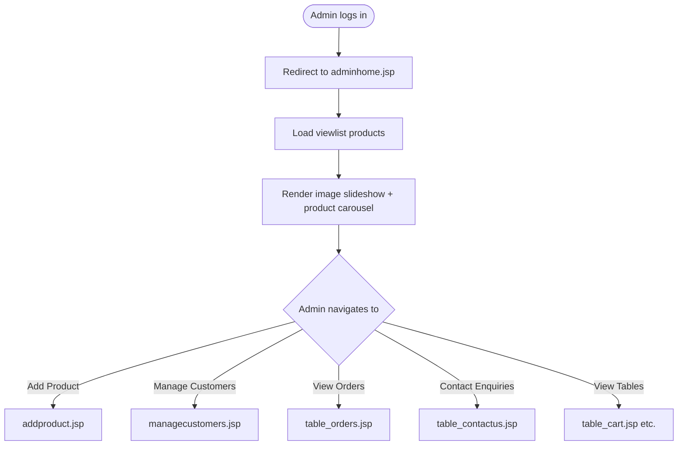

# UC-014: Admin View Dashboard

**Use Case ID:** UC-014  
**Name:** Admin View Dashboard  
**Version:** 1.0  
**Related Flows:** FL-026  
**Related Domain Concepts:** DC-001 (Product), DC-010 (ViewList)

---

## Description
An authenticated administrator accesses the admin home dashboard, which displays a visual overview of products in the catalogue (image slideshow and product carousel by category).

## Actors
| Actor | Role |
|---|---|
| **Admin** | Primary actor — views the dashboard |
| **System** | Retrieves and renders product overview data |

## Preconditions
- The admin is authenticated (cookie `tname` is present).
- Products exist in the product catalogue.

## Postconditions
- The admin can see a visual summary of available products grouped by category.

## Business Requirements

| BUREQ ID | Requirement |
|---|---|
| BUREQ-014-01 | The admin dashboard must display a visual product overview (image carousel and/or slideshow). |
| BUREQ-014-02 | Products from all four categories (mobile, TV, laptop, watch) must be visible on the dashboard. |

## Main Flow

| Step | Actor | Action |
|---|---|---|
| 1 | Admin | Logs in and is redirected to the admin dashboard. |
| 2 | System | Retrieves all products from the viewlist. |
| 3 | System | Renders an image slideshow and a featured product carousel. |
| 4 | Admin | Can navigate to other admin functions via the navigation bar. |

## Diagram

