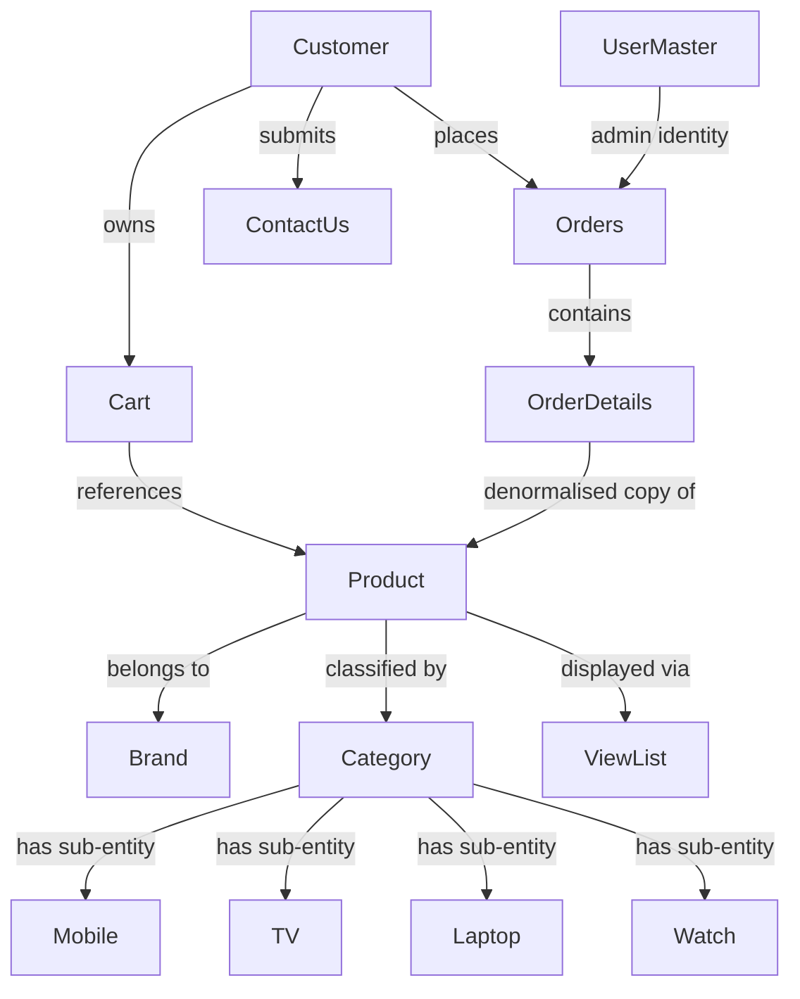

# Domain Concepts Catalog — EcommerceApp

**Document ID:** DCC-001  
**Version:** 1.0  
**Phase:** Coordination  
**Source:** `docs/discovered-domain-concepts.md`, `com/entity/`, `com/dao/`  
**Traced To:** All FUREQs, All UCs  

---

## Overview

This catalog consolidates all 14 domain concepts discovered from the EcommerceApp source code. Each entry includes the entity class, database table, key attributes, business rules, and traceability links.

---

## Table of Contents

| ID | Concept | DB Table | Domain |
|---|---|---|---|
| [DC-001](#dc-001-product) | Product | `product` | Product Catalogue |
| [DC-002](#dc-002-brand) | Brand | `brand` | Product Catalogue |
| [DC-003](#dc-003-category) | Category | `category` | Product Catalogue |
| [DC-004](#dc-004-customer) | Customer | `customer` | Authentication & Customer |
| [DC-005](#dc-005-usermaster-admin) | UserMaster (Admin) | `usermaster` | Authentication |
| [DC-006](#dc-006-cart) | Cart | `cart` | Shopping Cart |
| [DC-007](#dc-007-orders) | Orders | `orders` | Order Management |
| [DC-008](#dc-008-orderdetails) | OrderDetails | `order_details` | Order Management |
| [DC-009](#dc-009-contactus) | ContactUs | `Contactus` | Customer Support |
| [DC-010](#dc-010-viewlist) | ViewList | `viewlist` | Product Catalogue |
| [DC-011](#dc-011-mobile) | Mobile | `mobile` | Product Catalogue |
| [DC-012](#dc-012-tv) | TV | `tv` | Product Catalogue |
| [DC-013](#dc-013-laptop) | Laptop | `laptop` | Product Catalogue |
| [DC-014](#dc-014-watch) | Watch | `watch` | Product Catalogue |

---

## DC-001: Product

**Entity Class:** `com.entity.Product`  
**DB Table:** `product`  
**Domain:** Product Catalogue  

### Attributes

| Field | Type | Description |
|---|---|---|
| `pid` | `int` | Auto-generated primary key |
| `pname` | `String` | Product display name |
| `pprice` | `int` | Price in Indian Rupees (₹) |
| `pquantity` | `int` | Available stock quantity |
| `pimage` | `String` | Image filename stored in `images/` directory |
| `bid` | `int` | Foreign key → `brand.bid` |
| `cid` | `int` | Foreign key → `category.cid` |

### Business Rules
- A product must belong to exactly one brand and one category.
- Brand mapping is hardcoded: samsung→1, sony→2, lenovo→3, acer→4, onida→5.
- Category mapping is hardcoded: laptop→1, tv→2, mobile→3, watch→4.
- Image file must be `.jpg`, `.bmp`, `.jpeg`, `.png`, or `.webp` and ≤ 10 MB.
- Only admin users may create products; no update or delete endpoint exists.
- `pquantity` (stock quantity) is **never decremented** when orders are placed — no `UPDATE` to the `product` table exists anywhere in the application. Stock counts displayed to users are not reduced by purchases.

### Traceability
- **Flows:** FL-004 (Add Product), FL-005 (View Catalog), FL-006 (Browse by Category)
- **Use Cases:** UC-004, UC-011
- **FUREQs:** FUREQ-003
- **BUREQs:** BUREQ-004-01 to BUREQ-004-04, BUREQ-011-01 to BUREQ-011-04

---

## DC-002: Brand

**Entity Class:** `com.entity.brand`  
**DB Table:** `brand`  
**Domain:** Product Catalogue  

### Attributes

| Field | Type | Description |
|---|---|---|
| `bid` | `int` | Primary key (1–5) |
| `bname` | `String` | Brand name |

### Known Values
samsung (1), sony (2), lenovo (3), acer (4), onida (5)

### Business Rules
- Brand–to–ID mapping is hardcoded in `DAO.addproduct()`; an unknown brand results in `bid = 0`.
- `DAO.getAllbrand()` exists but is not used by any active servlet.

### Traceability
- **Flows:** FL-004, FL-005, FL-006
- **Use Cases:** UC-004, UC-011
- **FUREQs:** FUREQ-003
- **BUREQs:** BUREQ-011-02

---

## DC-003: Category

**Entity Class:** `com.entity.category`  
**DB Table:** `category`  
**Domain:** Product Catalogue  

### Attributes

| Field | Type | Description |
|---|---|---|
| `cid` | `int` | Primary key (1–4) |
| `cname` | `String` | Category name |

### Known Values
laptop (1), tv (2), mobile (3), watch (4)

### Business Rules
- Category mapping is hardcoded in `DAO.addproduct()`.
- Products are browsed via category-specific JSPs: `mobile.jsp` / `tv.jsp` / `laptop.jsp` / `watch.jsp` (and their `a`/`c` tripling variants).

### Traceability
- **Flows:** FL-004, FL-006
- **Use Cases:** UC-004, UC-011
- **FUREQs:** FUREQ-003
- **BUREQs:** BUREQ-004-02, BUREQ-011-02

---

## DC-004: Customer

**Entity Class:** `com.entity.customer`  
**DB Table:** `customer`  
**Domain:** Authentication & Customer Management  

### Attributes

| Field | Type | Description |
|---|---|---|
| `Username` | `String` | Customer's full name (unique) |
| `Password` | `String` | Plain-text password |
| `Email_Id` | `String` | Email address (unique; used as session identifier via `cname` cookie) |
| `Contact_No` | `String` | Phone number |

### Business Rules
- Both `Username` (Name) and `Email_Id` must be unique across all customers.
- Passwords are stored and compared in plain text (no hashing).
- `Email_Id` is set as the `cname` cookie on successful login (persistent, `maxAge=9999`).

### Traceability
- **Flows:** FL-001 (Registration), FL-002 (Login), FL-020 (Admin Delete Customer)
- **Use Cases:** UC-001, UC-002, UC-012
- **FUREQs:** FUREQ-001, FUREQ-002, FUREQ-006
- **BUREQs:** BUREQ-001-01 to BUREQ-001-04, BUREQ-002-01 to BUREQ-002-04, BUREQ-012-01 to BUREQ-012-03

---

## DC-005: UserMaster (Admin)

**Entity Class:** `com.entity.usermaster`  
**DB Table:** `usermaster`  
**Domain:** Authentication  

### Attributes

| Field | Type | Description |
|---|---|---|
| `Username` | `String` | Admin username (unique) |
| `Password` | `String` | Plain-text password |

### Business Rules
- Admin identity is maintained via `tname` cookie (value = username, `maxAge=9999`).
- There is no self-service registration; admin accounts are seeded directly into the database.

### Traceability
- **Flows:** FL-003 (Admin Login)
- **Use Cases:** UC-003
- **FUREQs:** FUREQ-002
- **BUREQs:** BUREQ-003-01 to BUREQ-003-03

---

## DC-006: Cart

**Entity Class:** `com.entity.cart`  
**DB Table:** `cart`  
**Domain:** Shopping Cart  

### Attributes

| Field | Type | Description |
|---|---|---|
| `CusName` | `String` | Owner identifier: customer email (authenticated) or "null" (guest) |
| `Pname` | `String` | Product name |
| `Category` | `String` | Product category |
| `Brand` | `String` | Product brand |
| `Price` | `int` | Unit price at time of add |
| `Quantity` | `int` | Number of units |
| `pimage` | `String` | Product image filename |

### Business Rules
- Guest carts use `CusName = "null"` (string literal, shared across all guests).
- If the same product is already in the cart, `Quantity` is incremented rather than a new row inserted.
- At checkout, all cart rows for the customer are transferred to `order_details` then deleted.

### Traceability
- **Flows:** FL-007 to FL-013
- **Use Cases:** UC-005, UC-006
- **FUREQs:** FUREQ-004
- **BUREQs:** BUREQ-005-01 to BUREQ-005-04, BUREQ-006-01 to BUREQ-006-04

---

## DC-007: Orders

**Entity Class:** `com.entity.orders`  
**DB Table:** `orders`  
**Domain:** Order Management  

### Attributes

| Field | Type | Description |
|---|---|---|
| `oid` | `int` | Auto-generated order ID |
| `CusName` | `String` | Customer email (matches `cname` cookie) |
| `City` | `String` | Shipping city |
| `Date` | `String` | Order date (string) |
| `TotalPrice` | `int` | Sum of all line items |
| `Status` | `String` | Always initialised as "Processing" |

### Business Rules
- Orders are created only when the cart is non-empty (validated by `DAO4.checkcart()` / `DAO4.checkcart2(N)` boolean checks).
- `Status` is **always** `"Processing"` at creation — **no code in the application ever changes this value**. There is no order state machine; shipped, delivered, and refunded states do not exist.
- Order cancellation is a **hard DELETE** from the `orders` table (`DELETE FROM orders WHERE Order_Id=?`), not a status update.
- Cancellation removes only the `orders` row — associated `order_details` rows are **not** deleted and become orphan records.

### Traceability
- **Flows:** FL-015 (Payment), FL-016 (Customer Cancel), FL-017 (Admin Cancel), FL-024 (View Orders)
- **Use Cases:** UC-007, UC-008, UC-009
- **FUREQs:** FUREQ-005
- **BUREQs:** BUREQ-007-01 to BUREQ-007-06, BUREQ-008-01 to BUREQ-008-03, BUREQ-009-01 to BUREQ-009-03

---

## DC-008: OrderDetails

**Entity Class:** `com.entity.orderdetails`  
**DB Table:** `order_details`  
**Domain:** Order Management  

### Attributes

| Field | Type | Description |
|---|---|---|
| `oid` | `int` | Foreign key → `orders.oid` |
| `Pname` | `String` | Product name (denormalised copy) |
| `Category` | `String` | Product category (denormalised) |
| `Brand` | `String` | Product brand (denormalised) |
| `Price` | `int` | Unit price at time of order |
| `Quantity` | `int` | Quantity ordered |

### Business Rules
- Order details are populated by copying cart rows at checkout.
- When an order is cancelled, the `orders` row is deleted but `order_details` rows are **not** deleted (soft-link pattern).
- No foreign key constraint is enforced by SQLite configuration.

### Traceability
- **Flows:** FL-015, FL-025 (View Order Details)
- **Use Cases:** UC-007, UC-008
- **FUREQs:** FUREQ-005
- **BUREQs:** BUREQ-007-04, BUREQ-008-03

---

## DC-009: ContactUs

**Entity Class:** `com.entity.contactus`  
**DB Table:** `Contactus`  
**Domain:** Customer Support  

### Attributes

| Field | Type | Description |
|---|---|---|
| `Name` | `String` | Submitter's full name |
| `Email` | `String` | Submitter's email address |
| `Phone` | `String` | Submitter's phone number |
| `Message` | `String` | Enquiry message text |

### Business Rules
- Both guests and authenticated customers may submit enquiries.
- Enquiries persist indefinitely until an admin deletes them.
- There is no deduplication or spam filtering.

### Traceability
- **Flows:** FL-018 (Guest Enquiry), FL-019 (Customer Enquiry), FL-021 (Admin Delete)
- **Use Cases:** UC-010, UC-013
- **FUREQs:** FUREQ-006
- **BUREQs:** BUREQ-010-01 to BUREQ-010-03, BUREQ-013-01 to BUREQ-013-03

---

## DC-010: ViewList

**Entity Class:** `com.entity.viewlist`  
**DB Table:** `viewlist`  
**Domain:** Product Catalogue  

### Attributes

| Field | Type | Description |
|---|---|---|
| `Pname` | `String` | Product name |
| `Category` | `String` | Category name |
| `Brand` | `String` | Brand name |
| `Price` | `int` | Product price |
| `Pimage` | `String` | Image filename |

### Business Rules
- `viewlist` is a denormalised view/table aggregating product information for catalogue display.
- Products are joined with brand and category to populate this table.

### Traceability
- **Flows:** FL-005 (View Catalog), FL-006 (Browse by Category)
- **Use Cases:** UC-004
- **FUREQs:** FUREQ-003

---

## DC-011: Mobile

**Entity Class:** `com.entity.mobile`  
**DB Table:** `mobile`  
**Domain:** Product Catalogue  

### Description
Category-specific entity for mobile phone products. Mirrors `product` attributes filtered to the mobile category. Used by category-browsing JSPs.

### Traceability
- **Flows:** FL-006
- **Use Cases:** UC-004
- **FUREQs:** FUREQ-003

---

## DC-012: TV

**Entity Class:** `com.entity.tv`  
**DB Table:** `tv`  
**Domain:** Product Catalogue  

### Description
Category-specific entity for television products. Used by TV category-browsing JSPs.

### Traceability
- **Flows:** FL-006
- **Use Cases:** UC-004
- **FUREQs:** FUREQ-003

---

## DC-013: Laptop

**Entity Class:** `com.entity.laptop`  
**DB Table:** `laptop`  
**Domain:** Product Catalogue  

### Description
Category-specific entity for laptop products. Used by laptop category-browsing JSPs.

### Traceability
- **Flows:** FL-006
- **Use Cases:** UC-004
- **FUREQs:** FUREQ-003

---

## DC-014: Watch

**Entity Class:** `com.entity.watch`  
**DB Table:** `watch`  
**Domain:** Product Catalogue  

### Description
Category-specific entity for watch products. Used by watch category-browsing JSPs.

### Traceability
- **Flows:** FL-006
- **Use Cases:** UC-004
- **FUREQs:** FUREQ-003

---

## Domain Relationship Summary

---

*Source: `docs/discovered-domain-concepts.md` | Cross-referenced with `docs/functional/requirements/`*
