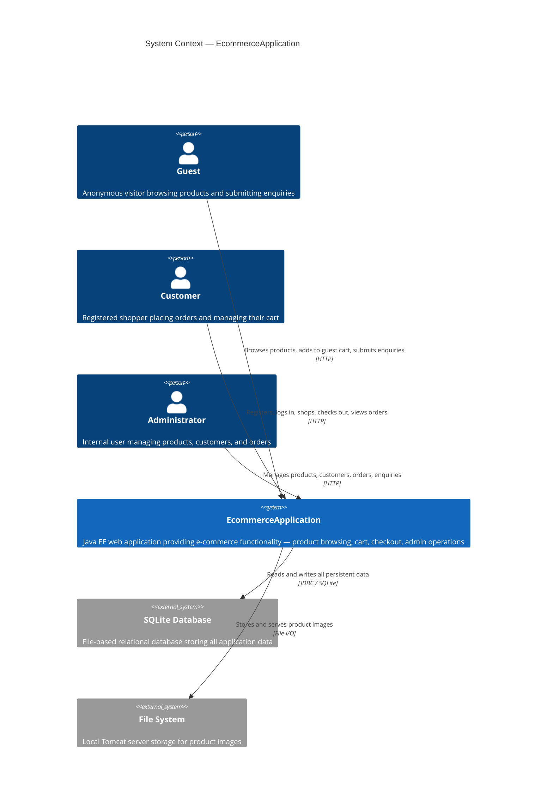
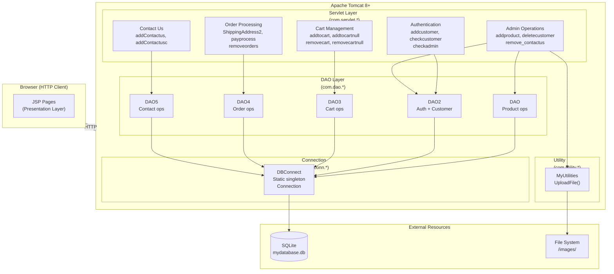
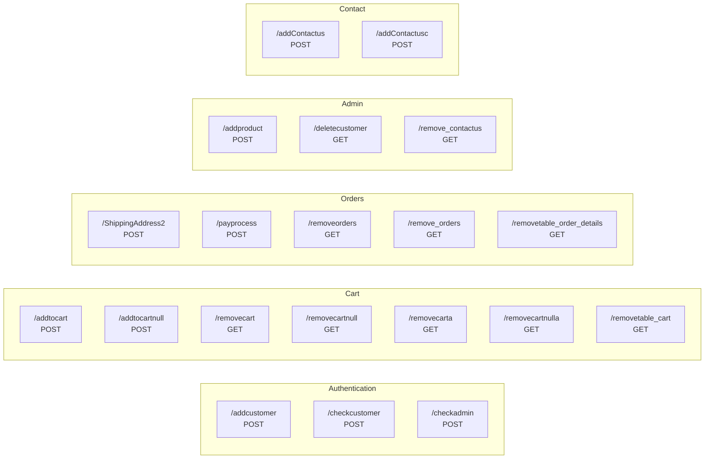

# System Architecture Diagram

**Diagram ID:** DIAG-001  
**Type:** C4 Context + Component  
**Traced To:** INT-001, INT-002, All FUREQs  

---

## C4 Context Diagram

---

## Component Architecture Diagram

---

## Servlet URL Map

