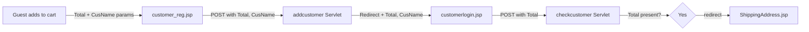

# FF-001: Customer Registration and Onboarding Flow

**Flow ID:** FF-001  
**Version:** 1.0  
**Derived From:** FL-001, FL-002  
**Traced To:** FUREQ-001, FUREQ-002, UC-001, UC-002, BP-001  

---

## Overview

The customer onboarding technical flow covers the complete implementation path from a guest submitting the registration form through account creation, session establishment, and optional cart-continuation into checkout.

---

## Entry Points

| Trigger | HTTP Method | Servlet | Source File |
|---|---|---|---|
| Submit registration form | `POST /addcustomer` | `com.servlet.addcustomer` | `addcustomer.java` |
| Submit login form | `POST /checkcustomer` | `com.servlet.checkcustomer` | `checkcustomer.java` |

---

## Registration Path

### Step 1: Input Processing
```
customer_reg.jsp
  → POST /addcustomer
    → request.getParameter("Username").trim()   → customer.setUsername()
    → request.getParameter("Password").trim()   → customer.setPassword()
    → request.getParameter("Email_Id").trim()   → customer.setEmail_Id()
    → request.getParameter("Contact_No").trim() → customer.setContact_No()
```

### Step 2: Duplicate Check
```
DAO2 dao = new DAO2(DBConnect.getConn())
dao.checkcust2(customer)
  → PreparedStatement: SELECT * FROM customer WHERE Name=? OR Email_Id=?
  → if ResultSet.next() == true  → duplicate → response.sendRedirect("fail.jsp")
  → if ResultSet.next() == false → proceed
```

### Step 3: Account Creation
```
dao.addcustomer(customer)
  → PreparedStatement: INSERT INTO customer VALUES (?,?,?,?)
  → if updateCount > 0:
      → new Cookie("creg", "1"), maxAge=10
      → response.sendRedirect("customerlogin.jsp?Total="+Total+"&CusName="+CusName)
  → if updateCount == 0:
      → response.sendRedirect("fail.jsp")
```

---

## Login Path

### Step 1: Credential Validation
```
customerlogin.jsp
  → POST /checkcustomer
    → request.getParameter("Email_Id").trim()  → customer.setEmail_Id()
    → request.getParameter("Password").trim()  → customer.setPassword()

DAO2 dao = new DAO2(DBConnect.getConn())
dao.checkcustomer(customer)
  → PreparedStatement: SELECT * FROM customer WHERE Email_Id=? AND Password=?
  → if ResultSet.next() == true → valid credentials
  → if ResultSet.next() == false → invalid
```

### Step 2: Session Establishment (Success)
```
→ Cookie cname = new Cookie("cname", email)
→ cname.setMaxAge(9999)
→ response.addCookie(cname)
→ if request.getParameter("Total") != null && !empty:
    → response.sendRedirect("ShippingAddress.jsp?Total="+Total+"&CusName="+email)
→ else:
    → response.sendRedirect("customerhome.jsp")
```

### Step 3: Failure Response
```
→ Cookie cerror = new Cookie("cerror", "Invalid email or password")
→ cerror.setMaxAge(10)
→ response.addCookie(cerror)
→ response.sendRedirect("customerlogin.jsp")
```

---

## Cart-Continuation Handoff



---

## DB Tables Accessed

| Table | Operations | DAO Method |
|---|---|---|
| `customer` | SELECT (duplicate check) | `DAO2.checkcust2()` |
| `customer` | INSERT (registration) | `DAO2.addcustomer()` |
| `customer` | SELECT (login validation) | `DAO2.checkcustomer()` |

---

## Full Sequence Diagram

```mermaid
sequenceDiagram
    participant Browser
    participant addcustomer as addcustomer Servlet
    participant checkcustomer as checkcustomer Servlet
    participant DAO2
    participant DB as customer table

    Browser->>addcustomer: POST /addcustomer (name, pwd, email, phone)
    addcustomer->>DAO2: checkcust2(customer)
    DAO2->>DB: SELECT WHERE Name=? OR Email_Id=?
    DB-->>DAO2: result
    alt Duplicate
        addcustomer-->>Browser: redirect fail.jsp
    else New user
        addcustomer->>DAO2: addcustomer(customer)
        DAO2->>DB: INSERT INTO customer
        DB-->>DAO2: rows
        alt Success
            addcustomer->>Browser: Set-Cookie creg; Max-Age=10
            addcustomer-->>Browser: redirect customerlogin.jsp?Total=&CusName=
            Browser->>checkcustomer: POST /checkcustomer (email, pwd)
            checkcustomer->>DAO2: checkcustomer(customer)
            DAO2->>DB: SELECT WHERE Email_Id=? AND Password=?
            DB-->>DAO2: result
            alt Valid
                checkcustomer->>Browser: Set-Cookie cname=email; Max-Age=9999
                checkcustomer-->>Browser: redirect customerhome.jsp (or ShippingAddress.jsp)
            else Invalid
                checkcustomer->>Browser: Set-Cookie cerror; Max-Age=10
                checkcustomer-->>Browser: redirect customerlogin.jsp
            end
        else Fail
            addcustomer-->>Browser: redirect fail.jsp
        end
    end
```
