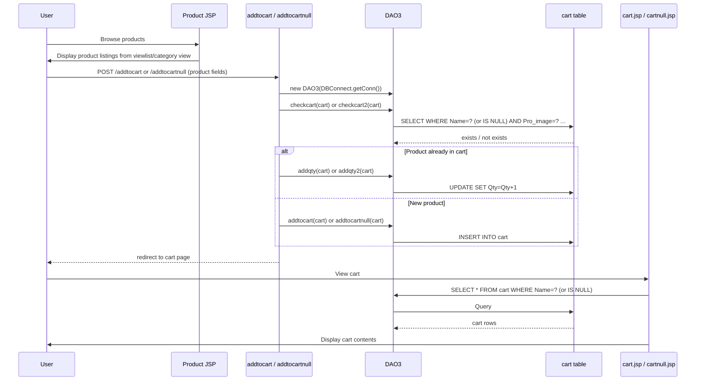

# FF-002: Product Catalogue and Cart Management Flow

**Flow ID:** FF-002  
**Version:** 1.0  
**Derived From:** FL-005 to FL-013  
**Traced To:** FUREQ-003, FUREQ-004, UC-004, UC-005, UC-006, BP-002  

---

## Overview

This flow covers the complete technical path from a user browsing the product catalogue through adding items to their cart and managing cart contents. It documents the JSP tripling pattern used for multi-role support and the dual-path cart system (named vs. anonymous).

---

## Part 1: Product Catalogue Browsing

### JSP Tripling Pattern

For each product category, three JSP variants exist to serve different user roles:

| Role | Mobile | TV | Laptop | Watch |
|---|---|---|---|---|
| Guest | `mobile.jsp` | `tv.jsp` | `laptop.jsp` | `watch.jsp` |
| Customer | `mobilec.jsp` | `tvc.jsp` | `laptopc.jsp` | `watchc.jsp` |
| Admin | `mobilea.jsp` | `tva.jsp` | `laptopa.jsp` | `watcha.jsp` |

All home pages (`index.jsp`, `customerhome.jsp`, `adminhome.jsp`) display products from the `viewlist` view.

### Category View to DB View Mapping

```
User navigates to category
  → Guest:    mobile.jsp → SELECT * FROM mobile (entity: com.entity.mobile)
  → Customer: mobilec.jsp → SELECT * FROM mobile
  → Admin:    mobilea.jsp → SELECT * FROM mobile

  → Guest:    tv.jsp → SELECT * FROM tv (entity: com.entity.tv)
  → Customer: tvc.jsp → SELECT * FROM tv
  ...etc.
```

### Product Detail Navigation

```
Product card in listing JSP
  → User clicks product or "Add to Cart" button
  → Form POST with product attributes as hidden fields:
      Pro_name, Brand_name, Cat_name, Price, Pro_image
```

---

## Part 2: Add to Cart

### Route Determination

```
From product JSP (customer-facing)  → POST /addtocart
From product JSP (guest-facing)     → POST /addtocartnull
From product JSP (admin-facing)     → POST /addtocartnulla (admin variant)
```

### Customer Add to Cart Path (`addtocart.java`)

```
POST /addtocart
  → Read cname cookie → customer email
  → Read form params: Brand_name, Cat_name, Pro_name, Price, Pro_image
  → cart entity: setName(email), setBrand_name, setCat_name, setPro_name, setPrice, setPro_image

  DAO3 dao3 = new DAO3(DBConnect.getConn())

  Step 1: Duplicate check
    dao3.checkcart(cart)
    → SELECT * FROM cart WHERE Name=? AND Pro_name=? AND Brand_name=?
         AND Cat_name=? AND Price=? AND Pro_image=?
    → ResultSet.next() == true → duplicate

  Step 2a: Duplicate → increment quantity
    dao3.addqty(cart)
    → UPDATE cart SET Qty = Qty+1 WHERE Name=? AND Pro_image=?

  Step 2b: New → insert row
    dao3.addtocart(cart)
    → INSERT INTO cart (Name, Brand_name, Cat_name, Pro_name, Price, Qty, Pro_image)
         VALUES (?,?,?,?,?,1,?)

  → response.sendRedirect("cart.jsp")
```

### Guest Add to Cart Path (`addtocartnull.java`)

```
POST /addtocartnull
  → (no cname cookie required)
  → cart entity: setName(null), set other fields from form

  DAO3 dao3 = new DAO3(DBConnect.getConn())

  Step 1: Duplicate check
    dao3.checkcart2(cart)
    → SELECT * FROM cart WHERE Name IS NULL AND Pro_name=? AND Brand_name=?
         AND Cat_name=? AND Price=? AND Pro_image=?

  Step 2a: Duplicate → dao3.addqty2(cart)
    → UPDATE cart SET Qty = Qty+1 WHERE Name IS NULL AND Pro_image=?

  Step 2b: New → dao3.addtocartnull(cart)
    → INSERT INTO cart VALUES (NULL,?,?,?,?,1,?)

  → response.sendRedirect("cartnull.jsp")
```

---

## Part 3: Cart Display

```
cart.jsp (customer):
  → Read cname cookie
  → DAO3: SELECT * FROM cart WHERE Name=?
  → Render cart table with: Brand, Category, Product, Price, Qty, Image, Remove link

cartnull.jsp (guest):
  → DAO3: SELECT * FROM cart WHERE Name IS NULL
  → Same table layout

table_cart.jsp (admin):
  → DAO3: SELECT * FROM cart
  → Shows all carts (all users)
```

---

## Part 4: Remove Cart Item

```
Customer → GET /removecart?Pro_image=&Name=<email>
  → DAO3.removecart(cart)
  → DELETE FROM cart WHERE Name=? AND Pro_image=?
  → redirect cart.jsp

Guest → GET /removecartnull?Pro_image=
  → DAO3.removecartnull(cart)
  → DELETE FROM cart WHERE Name IS NULL AND Pro_image=?
  → redirect cartnull.jsp

Admin (named) → GET /removecarta
Admin (guest)  → GET /removecartnulla
Admin (table)  → GET /removetable_cart?id=<cart_id>
```

---

## DB Tables Accessed

| Table | Operations | DAO Method |
|---|---|---|
| `viewlist` | SELECT (home/catalogue) | Direct JSP query |
| `mobile` | SELECT | Direct JSP query |
| `tv` | SELECT | Direct JSP query |
| `laptop` | SELECT | Direct JSP query |
| `watch` | SELECT | Direct JSP query |
| `cart` | SELECT (check dup, display) | `DAO3.checkcart()`, `DAO3.checkcart2()` |
| `cart` | INSERT | `DAO3.addtocart()`, `DAO3.addtocartnull()` |
| `cart` | UPDATE (qty) | `DAO3.addqty()`, `DAO3.addqty2()` |
| `cart` | DELETE | `DAO3.removecart()`, `DAO3.removecartnull()` |

---

## Full Cart Flow Sequence


