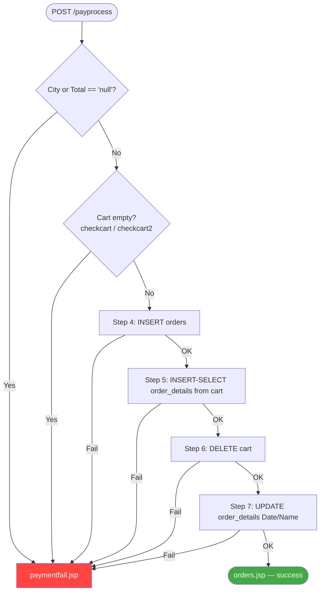
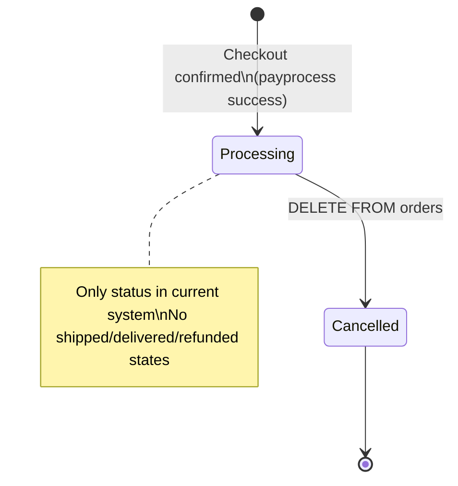

# FF-003: Checkout and Order Processing Flow

**Flow ID:** FF-003  
**Version:** 1.0  
**Derived From:** FL-014, FL-015, FL-016, FL-017, FL-024, FL-025  
**Traced To:** FUREQ-005, UC-007, UC-008, UC-009, BP-003  

---

## Overview

This flow documents the complete technical implementation of the checkout process, from shipping address submission through four sequential database operations that create the order. It also covers order history viewing and order cancellation.

---

## Part 1: Shipping Address and Payment Route

### Entry Point: ShippingAddress.jsp
```
ShippingAddress.jsp (form)
  → POST /ShippingAddress2

ShippingAddress2 Servlet (com.servlet.ShippingAddress2)
  → @WebServlet("/ShippingAddress2"), @MultipartConfig
  → doPost():
      String CName   = request.getParameter("CName")    // customer name
      String City    = request.getParameter("City")
      String Total   = request.getParameter("Total")    // total price (passed from JSP)
      String CusName = request.getParameter("CusName")  // "empty" = guest
      if cash radio selected (request.getParameter("cash") != null):
          → response.sendRedirect("confirmpayment.jsp?CName=...&City=...&Total=...&CusName=...")
      else if online radio selected (request.getParameter("online") != null):
          → response.sendRedirect("confirmonline.jsp?CName=...&City=...&Total=...&CusName=...")
```

**Note:** No DAO calls in `ShippingAddress2`; it is a pure routing servlet.

---

## Part 2: Order Creation (payprocess Servlet)

### Entry Point
```
confirmpayment.jsp or confirmonline.jsp (confirm button)
  → POST /payprocess
```

### Full Implementation Path (`com.servlet.payprocess`)

```
payprocess Servlet
  → @WebServlet("/payprocess")
  → doPost():

  Step 1: Read request parameters
    String CName   = request.getParameter("CName").trim()    // customer name from JSP
    String CusName = request.getParameter("CusName")         // "empty" = guest
    String City    = request.getParameter("City").trim()
    String Total   = request.getParameter("Total")           // total price from JSP (NOT computed in servlet)
    String N       = request.getParameter("N2").trim()       // cart owner identifier

  Step 2: Validate city and total provided
    if City.equals("null") || Total.equals("null"):
        → response.sendRedirect("paymentfail.jsp?msgf=Select any item first.")
        return

  Step 3: Validate cart not empty (boolean check — no cart items fetched)
    DAO4 dao4 = new DAO4(DBConnect.getConn())
    // Guest path (CusName == "empty"):
    //   boolean ok = dao4.checkcart()
    //   → SELECT * FROM cart WHERE Name IS NULL  (returns true if any row exists)
    // Customer path (CusName != "empty"):
    //   boolean ok = dao4.checkcart2(N)
    //   → SELECT * FROM cart WHERE Name=?  (returns true if any row exists)
    // NOTE: These are boolean checks only — cart items are NOT fetched or iterated
    if ok == false:
        → response.sendRedirect("paymentfail.jsp?msgf=Add items to cart first")
        return

  Step 4: Insert order header
    orders o = new orders()
    o.setCustomer_Name(CName)
    o.setCustomer_City(City)
    o.setDate(currentDate)
    o.setTotal_Price(Integer.parseInt(Total))
    o.setStatus("Processing")
    int result1 = dao4.addOrders(o)
    → INSERT INTO orders (Customer_Name, Customer_City, Date, Total_Price, Status) VALUES (?,?,?,?,?)
    if result1 == 0 → response.sendRedirect("paymentfail.jsp")

  Step 5: Bulk insert order details (INSERT-SELECT from cart — not a per-item loop)
    // Guest path:
    //   dao4.addOrder_details()
    //   → INSERT INTO order_details(Name,bname,cname,pname,pprice,pquantity,pimage)
    //        SELECT * FROM cart WHERE Name IS NULL
    // Customer path:
    //   dao4.addOrder_details2(N)
    //   → INSERT INTO order_details(Name,bname,cname,pname,pprice,pquantity,pimage)
    //        SELECT * FROM cart WHERE Name = ?
    // Rows are inserted with Date IS NULL (Date is set in Step 7)
    if result2 == 0 → response.sendRedirect("paymentfail.jsp")

  Step 6: Delete cart items
    // Guest path:  dao4.deletecart()  → DELETE FROM cart WHERE Name IS NULL
    // Customer path: dao4.deletecart2(N) → DELETE FROM cart WHERE Name = ?
    if result3 == 0 → response.sendRedirect("paymentfail.jsp")

  Step 7: Update order details with date (and Name for guest)
    order_details od = new order_details()
    od.setDate(currentDate)
    od.setName(N)
    // Guest path:
    //   dao4.updateOrder_details(od)
    //   → UPDATE order_details SET Date=?, Name=? WHERE Date IS NULL
    // Customer path:
    //   dao4.updateOrder_details2(od)
    //   → UPDATE order_details SET Date=? WHERE Date IS NULL
    if result4 == 0 → response.sendRedirect("paymentfail.jsp")

  Step 8: Redirect to order history
    → response.sendRedirect("orders.jsp")
```

---

## Part 3: View Order History

```
orders.jsp
  → Read cname cookie → customer email
  → JSP scriptlet: SELECT * FROM orders WHERE Customer_Name=?
  → Render table: Order_Id, City, Date, Total_Price, Status, [Cancel] [Details]
  → Each row has link: orderdetails.jsp?id=<Date>

orderdetails.jsp?id=<date>
  → JSP scriptlet: SELECT * FROM orders WHERE Date=?
  → JSP scriptlet: SELECT * FROM order_details WHERE Date=?
  → Render: order header + line items table
  → Compute running subtotal in JSP
```

---

## Part 4: Order Cancellation

```
Customer cancels:
  → GET /removeorders?id=<Order_Id>
  → com.servlet.removeorders (@WebServlet("/removeorders"))
  → DAO4.removeorders(orders o)
  → DELETE FROM orders WHERE Order_Id=?
  → redirect: orders.jsp

Admin cancels:
  → GET /remove_orders?id=<Order_Id>
  → com.servlet.remove_orders (@WebServlet("/remove_orders"))
  → DAO4.removeorders(orders o)
  → DELETE FROM orders WHERE Order_Id=?
  → redirect: table_orders.jsp

Note: Associated order_details rows are NOT deleted on cancellation.
```

---

## DB Tables Accessed

| Table | Operations | DAO Method | Step |
|---|---|---|---|
| `cart` | SELECT (boolean non-empty check) | `DAO4.checkcart()` / `DAO4.checkcart2(N)` | Step 3 |
| `orders` | INSERT | `DAO4.addOrders()` | Step 4 |
| `order_details` | INSERT-SELECT (bulk copy from cart) | `DAO4.addOrder_details()` / `DAO4.addOrder_details2(N)` | Step 5 |
| `cart` | DELETE | `DAO4.deletecart()` / `DAO4.deletecart2(N)` | Step 6 |
| `order_details` | UPDATE (set Date and Name) | `DAO4.updateOrder_details()` / `DAO4.updateOrder_details2()` | Step 7 |
| `orders` | SELECT | JSP scriptlet | View history |
| `order_details` | SELECT | JSP scriptlet | View details |
| `orders` | DELETE | `DAO4.removeorders()` | Cancellation |

---

## Transaction Diagram (Non-Atomic)



---

## Order State Lifecycle


