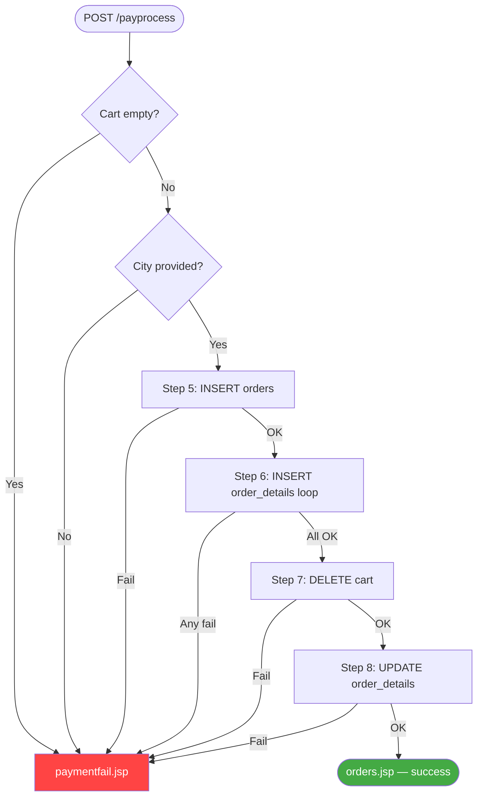
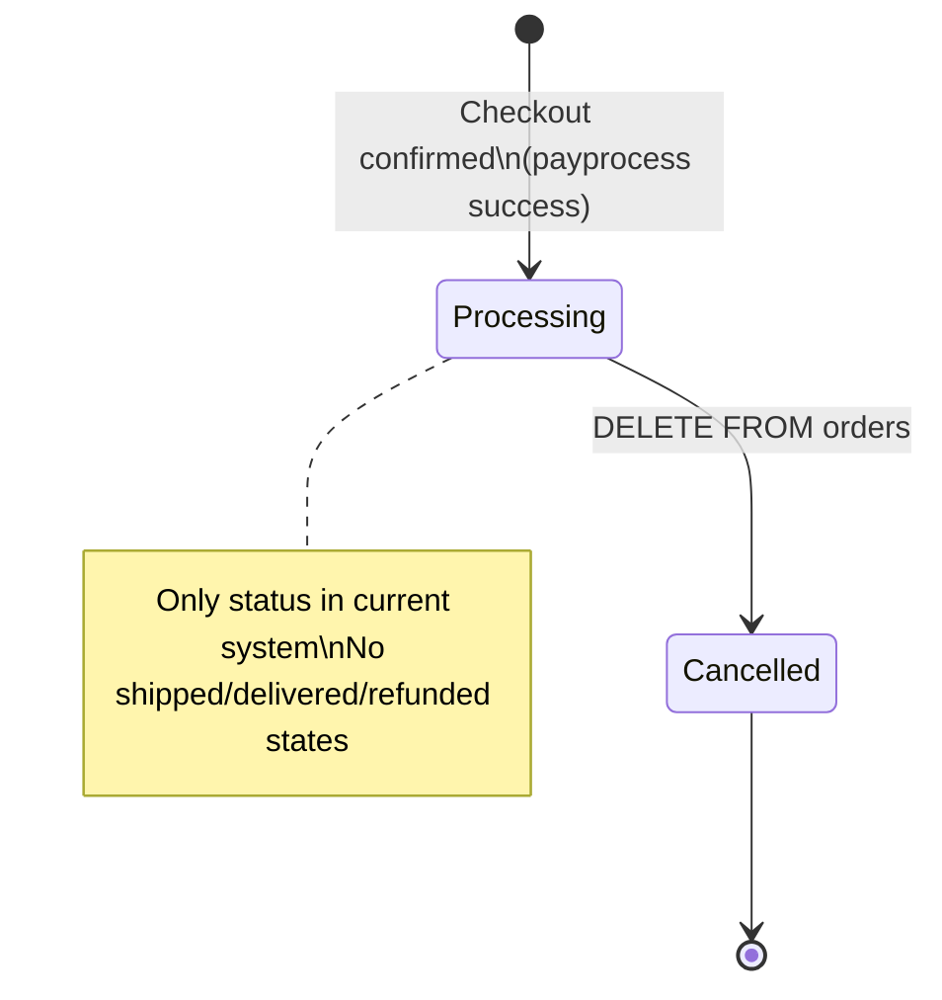

# FF-003: Checkout and Order Processing Flow

**Flow ID:** FF-003  
**Version:** 1.0  
**Derived From:** FL-014, FL-015, FL-016, FL-017, FL-024, FL-025  
**Traced To:** FUREQ-005, UC-007, UC-008, UC-009, BP-003  

---

## Overview

This flow documents the complete technical implementation of the checkout process, from shipping address submission through four sequential database operations that create the order. It also covers order history viewing and order cancellation.

---

## Part 1: Shipping Address and Payment Route

### Entry Point: ShippingAddress.jsp
```
ShippingAddress.jsp (form)
  → POST /ShippingAddress2

ShippingAddress2 Servlet (com.servlet.ShippingAddress2)
  → @WebServlet("/ShippingAddress2"), @MultipartConfig
  → doPost():
      String paymentmethod = request.getParameter("paymentmethod")
      + capture: Name, Address, City, State, Country, Pincode
      if "cash":
          → response.sendRedirect("confirmpayment.jsp?Name=...&City=...&...")
      else if "online":
          → response.sendRedirect("confirmonline.jsp?Name=...&City=...&...")
```

**Note:** No DAO calls in `ShippingAddress2`; it is a pure routing servlet.

---

## Part 2: Order Creation (payprocess Servlet)

### Entry Point
```
confirmpayment.jsp or confirmonline.jsp (confirm button)
  → POST /payprocess
```

### Full Implementation Path (`com.servlet.payprocess`)

```
payprocess Servlet
  → @WebServlet("/payprocess")
  → doPost():

  Step 1: Read session context
    String cname = getCookieValue("cname")   // customer email (or null for guest)
    String city  = request.getParameter("City")
    String name  = request.getParameter("Name")

  Step 2: Validate cart not empty
    DAO4 dao4 = new DAO4(DBConnect.getConn())
    List<cart> cartItems = dao4.getorders(cname)
    if cartItems.isEmpty():
        → response.sendRedirect("paymentfail.jsp")   // "Add items to cart first"
        return

  Step 3: Validate city provided
    if city == null || city.isEmpty():
        → response.sendRedirect("paymentfail.jsp")   // "Select any item first"
        return

  Step 4: Compute total price
    double total = sum of (item.Price * item.Qty) for each cartItem

  Step 5: Insert order header
    orders o = new orders()
    o.setCustomer_Name(cname)
    o.setCity(city)
    o.setTotal_Price(total)
    o.setStatus("Processing")
    int result1 = dao4.addorders(o)
    → INSERT INTO orders (Customer_Name, City, Total_Price, Status) VALUES (?,?,?,?)
    if result1 == 0 → response.sendRedirect("paymentfail.jsp")

  Step 6: Insert order details (one per cart item)
    for each cartItem in cartItems:
        order_details od = new order_details()
        od.setBrand_name(cartItem.getBrand_name())
        od.setCat_name(cartItem.getCat_name())
        od.setPro_name(cartItem.getPro_name())
        od.setPrice(cartItem.getPrice())
        od.setQty(cartItem.getQty())
        od.setPro_image(cartItem.getPro_image())
        int result2 = dao4.addorderdetails(od)
        → INSERT INTO order_details (Brand_name,Cat_name,Pro_name,Price,Qty,Pro_image)
               VALUES (?,?,?,?,?,?)
        if result2 == 0 → response.sendRedirect("paymentfail.jsp")

  Step 7: Delete cart items
    int result3 = dao4.deletecart(cname)
    → DELETE FROM cart WHERE Name=?    (or Name IS NULL for guest)
    if result3 == 0 → response.sendRedirect("paymentfail.jsp")

  Step 8: Update order details with date and customer name
    o.setDate(currentDate)
    int result4 = dao4.updateorderdetails(o)
    → UPDATE order_details SET Date=?, Customer_Name=? WHERE Customer_Name IS NULL
    if result4 == 0 → response.sendRedirect("paymentfail.jsp")

  Step 9: Redirect to order history
    → response.sendRedirect("orders.jsp")
```

---

## Part 3: View Order History

```
orders.jsp
  → Read cname cookie → customer email
  → JSP scriptlet: SELECT * FROM orders WHERE Customer_Name=?
  → Render table: Order_Id, City, Date, Total_Price, Status, [Cancel] [Details]
  → Each row has link: orderdetails.jsp?id=<Date>

orderdetails.jsp?id=<date>
  → JSP scriptlet: SELECT * FROM orders WHERE Date=?
  → JSP scriptlet: SELECT * FROM order_details WHERE Date=?
  → Render: order header + line items table
  → Compute running subtotal in JSP
```

---

## Part 4: Order Cancellation

```
Customer cancels:
  → GET /removeorders?id=<Order_Id>
  → com.servlet.removeorders (@WebServlet("/removeorders"))
  → DAO4.removeorders(orders o)
  → DELETE FROM orders WHERE Order_Id=?
  → redirect: orders.jsp

Admin cancels:
  → GET /remove_orders?id=<Order_Id>
  → com.servlet.remove_orders (@WebServlet("/remove_orders"))
  → DAO4.removeorders(orders o)
  → DELETE FROM orders WHERE Order_Id=?
  → redirect: table_orders.jsp

Note: Associated order_details rows are NOT deleted on cancellation.
```

---

## DB Tables Accessed

| Table | Operations | DAO Method | Step |
|---|---|---|---|
| `cart` | SELECT (validate + fetch items) | `DAO4.getorders()` | Step 2 |
| `orders` | INSERT | `DAO4.addorders()` | Step 5 |
| `order_details` | INSERT (per item) | `DAO4.addorderdetails()` | Step 6 |
| `cart` | DELETE | `DAO4.deletecart()` | Step 7 |
| `order_details` | UPDATE | `DAO4.updateorderdetails()` | Step 8 |
| `orders` | SELECT | JSP scriptlet | View history |
| `order_details` | SELECT | JSP scriptlet | View details |
| `orders` | DELETE | `DAO4.removeorders()` | Cancellation |

---

## Transaction Diagram (Non-Atomic)



---

## Order State Lifecycle


