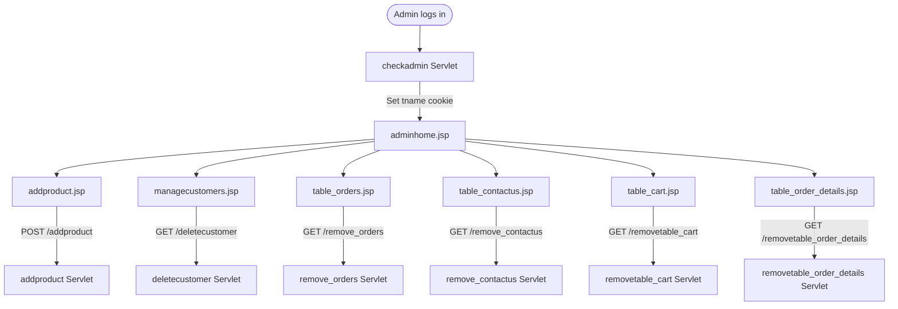

# FF-004: Admin Operations Flow

**Flow ID:** FF-004  
**Version:** 1.0  
**Derived From:** FL-003, FL-004, FL-017, FL-020, FL-021, FL-022, FL-023, FL-026  
**Traced To:** FUREQ-002, FUREQ-003, FUREQ-006, UC-003, UC-011, UC-012, UC-013, UC-014, BP-004, BP-005  

---

## Overview

This flow documents the complete admin-facing technical operations: authentication, dashboard, product management, customer management, enquiry management, and raw data table management.

---

## Part 1: Admin Authentication

```
adminlogin.jsp
  → POST /checkadmin

checkadmin Servlet (com.servlet.checkadmin)
  → @WebServlet("/checkadmin")
  → doPost():
      String name     = request.getParameter("Username").trim()
      String password = request.getParameter("Password").trim()
      usermaster u    = new usermaster()
      u.setName(name); u.setPassword(password)

      DAO2 dao2 = new DAO2(DBConnect.getConn())
      usermaster result = dao2.checkadmin(u)
      → SELECT * FROM usermaster WHERE name=? AND password=?

      if result != null:
          Cookie tname = new Cookie("tname", name)
          tname.setMaxAge(9999)
          response.addCookie(tname)
          response.sendRedirect("adminhome.jsp")
      else:
          Cookie aerror = new Cookie("aerror", "Invalid credentials")
          aerror.setMaxAge(10)
          response.addCookie(aerror)
          response.sendRedirect("adminlogin.jsp")
```

---

## Part 2: Admin Dashboard

```
adminhome.jsp
  → Guard: read tname cookie → if null → redirect adminlogin.jsp
  → JSP scriptlet: DAO.getViewlist() → SELECT * FROM viewlist
  → Render: image slideshow (rotating product images) + category carousel
  → Navigation links to all admin functions
```

---

## Part 3: Add Product

```
addproduct.jsp
  → Guard: tname cookie check
  → Multipart form: Pro_name, Price, Qty, Brand_Id, Cat_Id, Pro_image (file)
  → POST /addproduct

addproduct Servlet (com.servlet.addproduct)
  → @WebServlet("/addproduct"), @MultipartConfig
  → doPost():
      Part imagePart = request.getPart("Pro_image")
      String filename = Paths.get(imagePart.getSubmittedFileName()).getFileName().toString()

      MyUtilities.UploadFile(imagePart, uploadPath)
      → Validate extension: .jpg, .bmp, .jpeg, .png, .webp
      → Validate size: ≤ 10 MB
      → If invalid → show error (admin sees validation failure)
      → If valid → write file to uploadPath + filename

      product p = new product()
      p.setPro_name(request.getParameter("Pro_name"))
      p.setPrice(Double.parseDouble(request.getParameter("Price")))
      p.setQty(Integer.parseInt(request.getParameter("Qty")))
      p.setPro_image(filename)
      p.setBrand_Id(Integer.parseInt(request.getParameter("Brand_Id")))
      p.setCat_Id(Integer.parseInt(request.getParameter("Cat_Id")))

      DAO dao = new DAO(DBConnect.getConn())
      int result = dao.addproduct(p)
      → INSERT INTO product (Pro_name, Price, Qty, Pro_image, Brand_Id, Cat_Id)
             VALUES (?,?,?,?,?,?)

      if result > 0 → redirect success page
      else          → redirect failure page
```

---

## Part 4: Customer Management

```
managecustomers.jsp
  → Guard: tname cookie
  → JSP scriptlet: DAO2.getcustomer() → SELECT * FROM customer
  → Render table: Name, Email_Id, Contact_No, [Delete]

deletecustomer Servlet (com.servlet.deletecustomer)
  → @WebServlet("/deletecustomer")
  → GET: id = request.getParameter("id")   // customer Name
         email = request.getParameter("email")
  → DAO2.deletecustomer(customer c)
  → DELETE FROM customer WHERE Name=? AND Email_Id=?
  → redirect: managecustomers.jsp
```

---

## Part 5: Contact Enquiry Management

```
table_contactus.jsp
  → Guard: tname cookie
  → JSP scriptlet: DAO5.getcontactus() → SELECT * FROM Contactus
  → Render table: Name, Email_Id, Contact_No, Message, [Remove]

remove_contactus Servlet (com.servlet.remove_contactus)
  → @WebServlet("/remove_contactus")
  → GET: id = request.getParameter("id")   // Contact_Id
  → DAO5.removecontactus(contactus c)
  → DELETE FROM Contactus WHERE Contact_Id=?
  → redirect: table_contactus.jsp
```

---

## Part 6: Data Table Management

### Cart Table Admin

```
table_cart.jsp
  → Guard: tname cookie
  → DAO3: SELECT * FROM cart (all users, all rows)
  → [Remove] link → GET /removetable_cart?id=<cart row identifier>

removetable_cart Servlet (com.servlet.removetable_cart)
  → @WebServlet("/removetable_cart")
  → DELETE FROM cart WHERE Pro_image=? AND Name=?   (or Name IS NULL)
  → redirect: table_cart.jsp
```

### Order Details Table Admin

```
table_order_details.jsp
  → Guard: tname cookie
  → JSP scriptlet: SELECT * FROM order_details
  → [Remove] link → GET /removetable_order_details?id=<OD_Id>

removetable_order_details Servlet (com.servlet.removetable_order_details)
  → @WebServlet("/removetable_order_details")
  → DELETE FROM order_details WHERE OD_Id=?
  → redirect: table_order_details.jsp
```

### Orders Table Admin

```
table_orders.jsp
  → Guard: tname cookie
  → JSP scriptlet: SELECT * FROM orders
  → [Remove] link → GET /remove_orders?id=<Order_Id>

remove_orders Servlet (com.servlet.remove_orders)
  → @WebServlet("/remove_orders")
  → DAO4.removeorders(orders o) → DELETE FROM orders WHERE Order_Id=?
  → redirect: table_orders.jsp
```

---

## DB Tables Accessed

| Table | Operations | DAO / Method |
|---|---|---|
| `usermaster` | SELECT (login) | `DAO2.checkadmin()` |
| `viewlist` | SELECT (dashboard) | JSP scriptlet |
| `product` | INSERT | `DAO.addproduct()` |
| `customer` | SELECT, DELETE | `DAO2.getcustomer()`, `DAO2.deletecustomer()` |
| `Contactus` | SELECT, DELETE | `DAO5.getcontactus()`, `DAO5.removecontactus()` |
| `cart` | SELECT, DELETE | JSP + `removetable_cart` |
| `order_details` | SELECT, DELETE | JSP + `removetable_order_details` |
| `orders` | SELECT, DELETE | JSP + `remove_orders` |

---

## Admin Navigation Architecture


