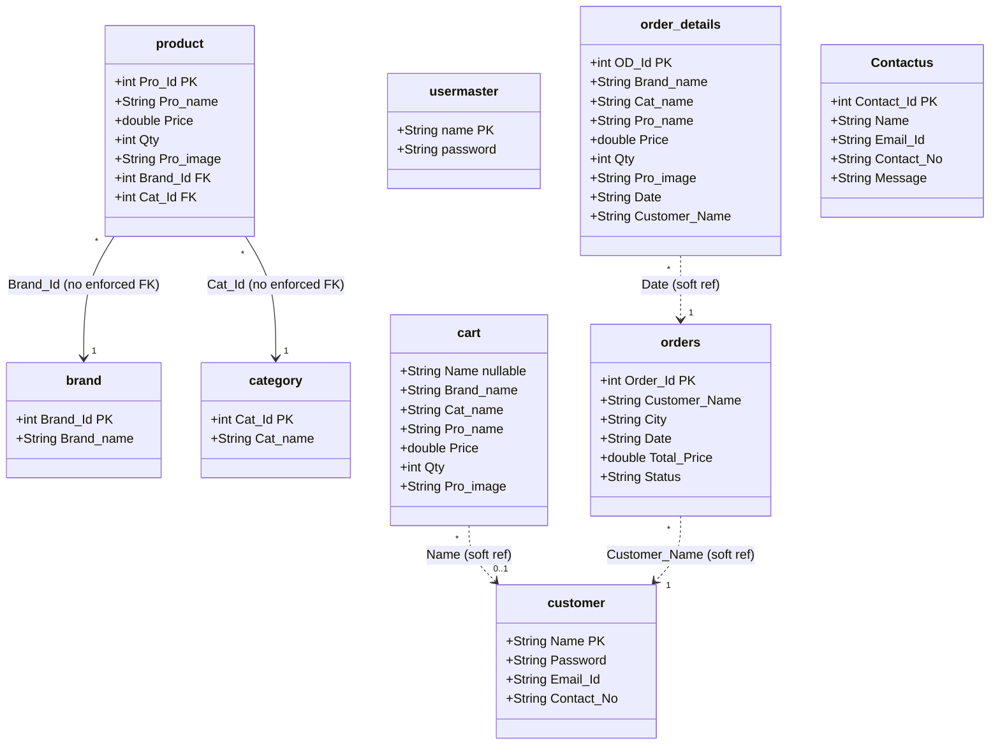
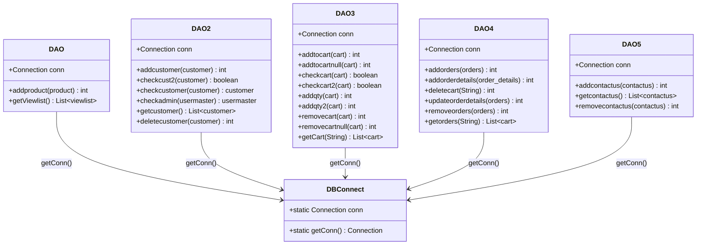

# INT-001: SQLite Database Integration

**Integration ID:** INT-001  
**Version:** 1.0  
**Type:** Relational Database  
**Technology:** SQLite via `org.xerial:sqlite-jdbc`  
**Traced To:** NFUREQ-002, All FUREQs  

---

## Overview

The EcommerceApplication integrates with a local SQLite database file (`mydatabase.db`) as its sole persistent data store. The database connection is managed through a static singleton pattern in `com.conn.DBConnect`.

---

## Connection Configuration

### `com.conn.DBConnect`

```java
// File: EcommerceApp/src/main/java/com/conn/DBConnect.java
public class DBConnect {
    static Connection conn = null;

    public static Connection getConn() {
        try {
            Class.forName("com.mysql.cj.jdbc.Driver");  // Legacy — not used
            if (conn == null) {
                conn = DriverManager.getConnection(
                    "jdbc:sqlite:/path/to/mydatabase.db"
                );
            }
        } catch (Exception e) {
            e.printStackTrace();
        }
        return conn;
    }
}
```

**Key Notes:**
- `Class.forName("com.mysql.cj.jdbc.Driver")` is present as legacy code — the actual connection is SQLite
- Connection path (`/path/to/mydatabase.db`) is hardcoded and must be updated per deployment
- The connection is a static singleton — **not thread-safe**
- Connection is never closed during application lifecycle

---

## Database Schema

### Tables

| Table | Primary Key | Description |
|---|---|---|
| `brand` | `Brand_Id` | Product brand lookup (Samsung, Sony, Lenovo, Acer, Onida) |
| `category` | `Cat_Id` | Product category lookup (Laptop, TV, Mobile, Watch) |
| `product` | `Pro_Id` | Product catalogue |
| `customer` | (Name + Email_Id) | Registered customer accounts |
| `usermaster` | (name) | Admin accounts |
| `cart` | (Name + Pro_image) | Shopping cart (Name=NULL for guest) |
| `orders` | `Order_Id` | Order headers |
| `order_details` | `OD_Id` | Order line items (linked to orders via Date) |
| `Contactus` | `Contact_Id` | Contact enquiries |

### Category Views (Read-Only)

| View | Description |
|---|---|
| `viewlist` | All products with brand and category names (used for home/dashboard) |
| `mobile` | Products where Cat_name = 'Mobile' |
| `tv` | Products where Cat_name = 'TV' |
| `laptop` | Products where Cat_name = 'Laptop' |
| `watch` | Products where Cat_name = 'Watch' |

---

## Entity-Relationship Diagram



---

## DAO Layer Architecture



---

## Query Inventory

| Operation | Table | SQL Pattern | DAO |
|---|---|---|---|
| Register customer | `customer` | `INSERT INTO customer VALUES (?,?,?,?)` | `DAO2.addcustomer()` |
| Check duplicate | `customer` | `SELECT * WHERE Name=? OR Email_Id=?` | `DAO2.checkcust2()` |
| Login customer | `customer` | `SELECT * WHERE Email_Id=? AND Password=?` | `DAO2.checkcustomer()` |
| Login admin | `usermaster` | `SELECT * WHERE name=? AND password=?` | `DAO2.checkadmin()` |
| Add product | `product` | `INSERT INTO product VALUES (?,?,?,?,?,?)` | `DAO.addproduct()` |
| Check cart dup (customer) | `cart` | `SELECT * WHERE Name=? AND Pro_image=? ...` | `DAO3.checkcart()` |
| Check cart dup (guest) | `cart` | `SELECT * WHERE Name IS NULL AND Pro_image=? ...` | `DAO3.checkcart2()` |
| Add to cart (customer) | `cart` | `INSERT INTO cart VALUES (?,?,?,?,?,1,?)` | `DAO3.addtocart()` |
| Add to cart (guest) | `cart` | `INSERT INTO cart VALUES (NULL,?,?,?,?,1,?)` | `DAO3.addtocartnull()` |
| Increment qty (customer) | `cart` | `UPDATE cart SET Qty=Qty+1 WHERE Name=? AND Pro_image=?` | `DAO3.addqty()` |
| Delete cart item (customer) | `cart` | `DELETE FROM cart WHERE Name=? AND Pro_image=?` | `DAO3.removecart()` |
| Create order | `orders` | `INSERT INTO orders (...) VALUES (?,?,?,?)` | `DAO4.addorders()` |
| Add order details | `order_details` | `INSERT INTO order_details (...) VALUES (?,?,?,?,?,?)` | `DAO4.addorderdetails()` |
| Clear cart | `cart` | `DELETE FROM cart WHERE Name=?` | `DAO4.deletecart()` |
| Update order details | `order_details` | `UPDATE order_details SET Date=?, Customer_Name=? ...` | `DAO4.updateorderdetails()` |
| Cancel order | `orders` | `DELETE FROM orders WHERE Order_Id=?` | `DAO4.removeorders()` |
| Submit enquiry | `Contactus` | `INSERT INTO Contactus VALUES (?,?,?,?)` | `DAO5.addcontactus()` |
| Delete customer | `customer` | `DELETE FROM customer WHERE Name=? AND Email_Id=?` | `DAO2.deletecustomer()` |
