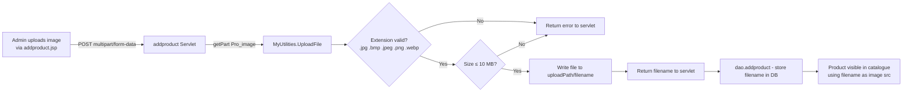

# INT-002: File System Integration — Image Uploads

**Integration ID:** INT-002  
**Version:** 1.0  
**Type:** Local File System  
**Technology:** Java Servlet `@MultipartConfig` + `com.utility.MyUtilities`  
**Traced To:** FUREQ-003, NFUREQ-001, NFUREQ-002, UC-011, BP-004  

---

## Overview

Product images are uploaded by admins and stored on the local file system of the Tomcat application server. The `MyUtilities.UploadFile()` utility method handles validation and write operations. The image filename is subsequently stored in the `product.Pro_image` column and used as a surrogate product identifier across cart and order records.

---

## Integration Components

| Component | Location | Role |
|---|---|---|
| `addproduct` Servlet | `com.servlet.addproduct` | Receives multipart form data, calls utility |
| `MyUtilities` | `com.utility.MyUtilities` | Validates and writes image file |
| `DAO.java` | `com.dao.DAO` | Contains hardcoded upload path constant |
| File System | Tomcat server path | Stores physical image files |
| `product.Pro_image` | SQLite `product` table | Stores image filename reference |

---

## Upload Process



---

## `MyUtilities.UploadFile()` — Validation Logic

```java
// com/utility/MyUtilities.java
public static String UploadFile(Part part, String uploadPath) {
    String filename = Paths.get(part.getSubmittedFileName()).getFileName().toString();
    String extension = filename.substring(filename.lastIndexOf('.') + 1).toLowerCase();

    // Allowed extensions
    List<String> allowed = Arrays.asList("jpg", "bmp", "jpeg", "png", "webp");
    if (!allowed.contains(extension)) {
        return null; // invalid type
    }

    // Size check
    if (part.getSize() > 10 * 1024 * 1024) { // 10 MB
        return null; // too large
    }

    // Write to file system
    part.write(uploadPath + File.separator + filename);
    return filename;
}
```

---

## Configuration

| Parameter | Location | Description |
|---|---|---|
| Upload directory path | `DAO.java` (hardcoded constant) | Must be updated per deployment environment |
| Allowed extensions | `MyUtilities.java` | `.jpg`, `.bmp`, `.jpeg`, `.png`, `.webp` |
| Maximum file size | `MyUtilities.java` | 10 MB (10,485,760 bytes) |
| `@MultipartConfig` | `addproduct` Servlet annotation | Enables `request.getPart()` parsing |

---

## Image Reference Chain

```
Admin uploads → file saved as "product_image.jpg"
             → product.Pro_image = "product_image.jpg"
             → cart.Pro_image = "product_image.jpg"   (copied at add-to-cart)
             → order_details.Pro_image = "product_image.jpg"  (copied at checkout)
             → JSP src="/images/product_image.jpg"  (rendered in browser)
```

**Implication:** The filename is the only identifier linking a product to its cart/order records. If the physical file is renamed, deleted, or replaced, the image will break across all historical orders.

---

## Known Limitations and Risks

| Risk | Description | Severity |
|---|---|---|
| Path Traversal | `getSubmittedFileName()` used without normalisation — an attacker could craft filenames with `../` sequences | MEDIUM |
| MIME Type Not Checked | Only file extension is validated, not actual content type | MEDIUM |
| Hardcoded Path | Upload path in `DAO.java` must be changed manually on each environment | LOW |
| No Deduplication | Uploading two files with the same name silently overwrites the existing file | LOW |
| No CDN / Object Storage | Files are served from the Tomcat server's local disk; not horizontally scalable | LOW |
| No File Deletion | Removing a product from the UI (not supported) would also require manual file deletion | N/A |
