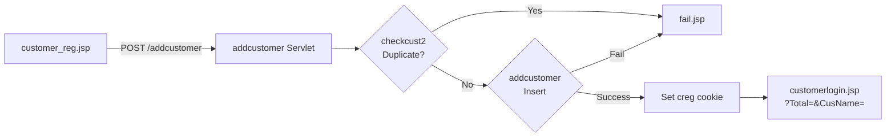
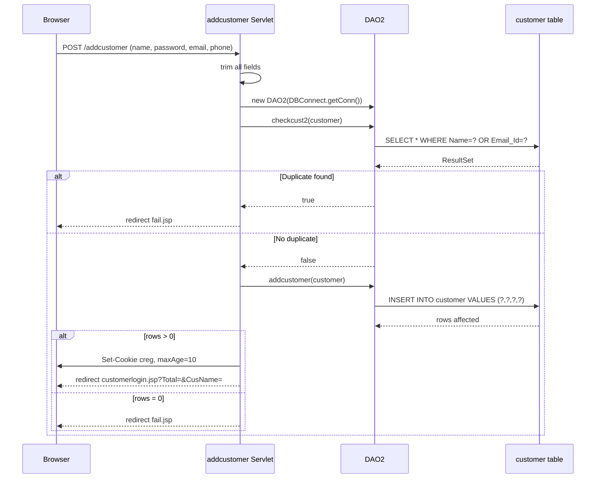

# FUREQ-001: Customer Registration

**Functional Requirement ID:** FUREQ-001  
**Version:** 1.0  
**Derived From:** BUREQ-001-01, BUREQ-001-02, BUREQ-001-03, BUREQ-001-04  
**Traced To Use Cases:** UC-001  
**Traced To Processes:** BP-001  

---

## Overview

The system shall allow a guest visitor to register a new customer account. Registration collects identity and contact information, validates uniqueness, and persists the account to the database.

---

## Functional Requirements

### FUREQ-001-01: Input Field Capture

**Source:** BUREQ-001-02  
**Description:** The registration form shall capture the following fields:

| Field | DB Column | Entity Field | Constraints |
|---|---|---|---|
| Full Name | `Name` | `customer.Username` | Non-empty, trimmed |
| Password | `Password` | `customer.Password` | Non-empty, trimmed |
| Email Address | `Email_Id` | `customer.Email_Id` | Non-empty, trimmed |
| Contact Number | `Contact_No` | `customer.Contact_No` | Non-empty, trimmed |

**Implementation:**  
- Servlet: `com.servlet.addcustomer` (`@WebServlet("/addcustomer")`)  
- Inputs read via `request.getParameter()` and trimmed with `.trim()`  
- Entity: `com.entity.customer`

---

### FUREQ-001-02: Uniqueness Validation

**Source:** BUREQ-001-01  
**Description:** Before inserting a new record, the system shall verify that neither the `Name` nor the `Email_Id` already exists in the `customer` table.

**Implementation:**  
- DAO method: `DAO2.checkcust2(customer c)` — `com.dao.DAO2`  
- SQL: `SELECT * FROM customer WHERE Name=? OR Email_Id=?`  
- If result set is non-empty → duplicate found → redirect to `fail.jsp`

---

### FUREQ-001-03: Account Persistence

**Source:** BUREQ-001-01, BUREQ-001-02  
**Description:** When the uniqueness check passes, the system shall insert the new customer record.

**Implementation:**  
- DAO method: `DAO2.addcustomer(customer c)`  
- SQL: `INSERT INTO customer VALUES (?,?,?,?)`  
- Table: `customer` (`Name`, `Password`, `Email_Id`, `Contact_No`)  
- Result > 0 → success; result = 0 → redirect to `fail.jsp`

---

### FUREQ-001-04: Cart-Continuation Support

**Source:** BUREQ-001-03  
**Description:** After successful registration, the system shall pass the guest cart context (`Total`, `CusName`) to the login redirect URL so that checkout can continue after login.

**Implementation:**  
- Flash cookie `creg` set with `maxAge=10` seconds to signal registration success  
- Redirect target: `customerlogin.jsp?Total=<Total>&CusName=<CusName>`  
- Parameters originate from the add-to-cart flow and are propagated through the registration form as hidden inputs

---

### FUREQ-001-05: Failure Notification

**Source:** BUREQ-001-04  
**Description:** On duplicate detection or database error, the system shall redirect to `fail.jsp`.

**Implementation:**  
- Redirect: `response.sendRedirect("fail.jsp")`  
- No detailed error discrimination is exposed to the user; both duplicate and DB errors use the same `fail.jsp`

---

## Data Flow Diagram

---

## Technical Sequence

---

## Validation Rules

| Field | Rule | Enforced By |
|---|---|---|
| Name | Must not already exist in `customer.Name` | `DAO2.checkcust2()` |
| Email | Must not already exist in `customer.Email_Id` | `DAO2.checkcust2()` |
| All fields | Must be non-null (form-level, not server-validated explicitly) | HTML form |

---

## Known Limitations

- No server-side format validation of email address.
- No password strength enforcement.
- Passwords are stored in plaintext — no hashing applied.
- Both duplicate and DB failure redirect to the same `fail.jsp` without distinguishing the cause.
