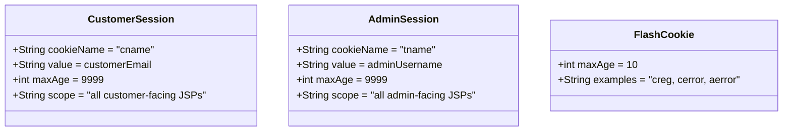

# FUREQ-002: Authentication — Customer and Admin Login

**Functional Requirement ID:** FUREQ-002  
**Version:** 1.0  
**Derived From:** BUREQ-002-01 to BUREQ-002-04, BUREQ-003-01 to BUREQ-003-03  
**Traced To Use Cases:** UC-002, UC-003  
**Traced To Processes:** BP-001  

---

## Overview

The system supports two independent authentication flows: one for registered customers and one for administrators. Both flows use cookie-based session management with no `HttpSession`. Authentication state is carried by a single cookie (`cname` for customers, `tname` for admins) set on the response.

---

## Functional Requirements

### FUREQ-002-01: Customer Login — Credential Validation

**Source:** BUREQ-002-01  
**Description:** The system shall validate a customer's credentials by querying the `customer` table.

**Implementation:**  
- Servlet: `com.servlet.checkcustomer` (`@WebServlet("/checkcustomer")`)  
- DAO: `DAO2.checkcustomer(customer c)`  
- SQL: `SELECT * FROM customer WHERE Email_Id=? AND Password=?`  
- Match found → proceed; no match → error cookie + redirect to `customerlogin.jsp`

---

### FUREQ-002-02: Customer Login — Session Cookie

**Source:** BUREQ-002-02  
**Description:** On successful login, the system shall set a persistent cookie named `cname` equal to the customer's email address.

**Implementation:**  
- Cookie construction: `new Cookie("cname", email)`  
- `cookie.setMaxAge(9999)` — approximately 2.78 hours  
- All subsequent authenticated pages read `cname` from `request.getCookies()` to identify the customer

---

### FUREQ-002-03: Customer Login — Cart Continuation

**Source:** BUREQ-002-03  
**Description:** If the customer logged in with a pending guest cart context (`Total` parameter present), the system shall redirect to `ShippingAddress.jsp` rather than the home page.

**Implementation:**  
- `request.getParameter("Total")` checked after successful authentication  
- If present and non-empty → `response.sendRedirect("ShippingAddress.jsp?...")`  
- If absent → `response.sendRedirect("customerhome.jsp")`

---

### FUREQ-002-04: Customer Login — Failure

**Source:** BUREQ-002-04  
**Description:** If credentials do not match, the system shall set a flash error cookie and redirect back to the login page.

**Implementation:**  
- Flash cookie: `new Cookie("cerror", "Invalid email or password")`, `maxAge=10`  
- Redirect: `customerlogin.jsp`

---

### FUREQ-002-05: Admin Login — Credential Validation

**Source:** BUREQ-003-01  
**Description:** The system shall validate admin credentials by querying the `usermaster` table.

**Implementation:**  
- Servlet: `com.servlet.checkadmin` (`@WebServlet("/checkadmin")`)  
- DAO: `DAO2.checkadmin(usermaster u)`  
- SQL: `SELECT * FROM usermaster WHERE name=? AND password=?`  
- Match found → proceed; no match → error cookie + redirect to `adminlogin.jsp`

---

### FUREQ-002-06: Admin Login — Session Cookie

**Source:** BUREQ-003-02  
**Description:** On successful admin login, the system shall set a persistent cookie named `tname` equal to the admin's username.

**Implementation:**  
- Cookie construction: `new Cookie("tname", username)`  
- `cookie.setMaxAge(9999)`  
- Admin-facing JSPs read `tname` from `request.getCookies()` to gate admin access

---

### FUREQ-002-07: Admin Login — Failure

**Source:** BUREQ-003-03  
**Description:** If admin credentials are invalid, the system shall set a flash error cookie and redirect to the admin login page.

**Implementation:**  
- Flash cookie: `new Cookie("aerror", "...")`, `maxAge=10`  
- Redirect: `adminlogin.jsp`

---

## Cookie Architecture



---

## Customer Login Sequence

```mermaid
sequenceDiagram
    participant Browser
    participant checkcustomer as checkcustomer Servlet
    participant DAO2
    participant customer_table as customer table

    Browser->>checkcustomer: POST /checkcustomer (email, password)
    checkcustomer->>DAO2: new DAO2(DBConnect.getConn())
    checkcustomer->>DAO2: checkcustomer(customer)
    DAO2->>customer_table: SELECT * WHERE Email_Id=? AND Password=?
    customer_table-->>DAO2: ResultSet
    alt Valid credentials
        DAO2-->>checkcustomer: customer object
        checkcustomer->>Browser: Set-Cookie cname=email; Max-Age=9999
        alt Total param present (guest cart)
            checkcustomer-->>Browser: redirect ShippingAddress.jsp
        else No guest cart
            checkcustomer-->>Browser: redirect customerhome.jsp
        end
    else Invalid credentials
        checkcustomer->>Browser: Set-Cookie cerror; Max-Age=10
        checkcustomer-->>Browser: redirect customerlogin.jsp
    end
```

---

## Admin Login Sequence

```mermaid
sequenceDiagram
    participant Browser
    participant checkadmin as checkadmin Servlet
    participant DAO2
    participant usermaster_table as usermaster table

    Browser->>checkadmin: POST /checkadmin (username, password)
    checkadmin->>DAO2: new DAO2(DBConnect.getConn())
    checkadmin->>DAO2: checkadmin(usermaster)
    DAO2->>usermaster_table: SELECT * WHERE name=? AND password=?
    usermaster_table-->>DAO2: ResultSet
    alt Valid credentials
        DAO2-->>checkadmin: usermaster object
        checkadmin->>Browser: Set-Cookie tname=username; Max-Age=9999
        checkadmin-->>Browser: redirect adminhome.jsp
    else Invalid credentials
        checkadmin->>Browser: Set-Cookie aerror; Max-Age=10
        checkadmin-->>Browser: redirect adminlogin.jsp
    end
```

---

## Known Limitations

- Passwords are stored and compared in plaintext; no hashing.
- Cookies have no `HttpOnly` or `Secure` flags — vulnerable to XSS and network interception.
- Cookies are client-forgeable — no server-side session validation.
- Cookie expiry is `maxAge=9999` seconds (~2.78 hours), not based on inactivity timeout.
