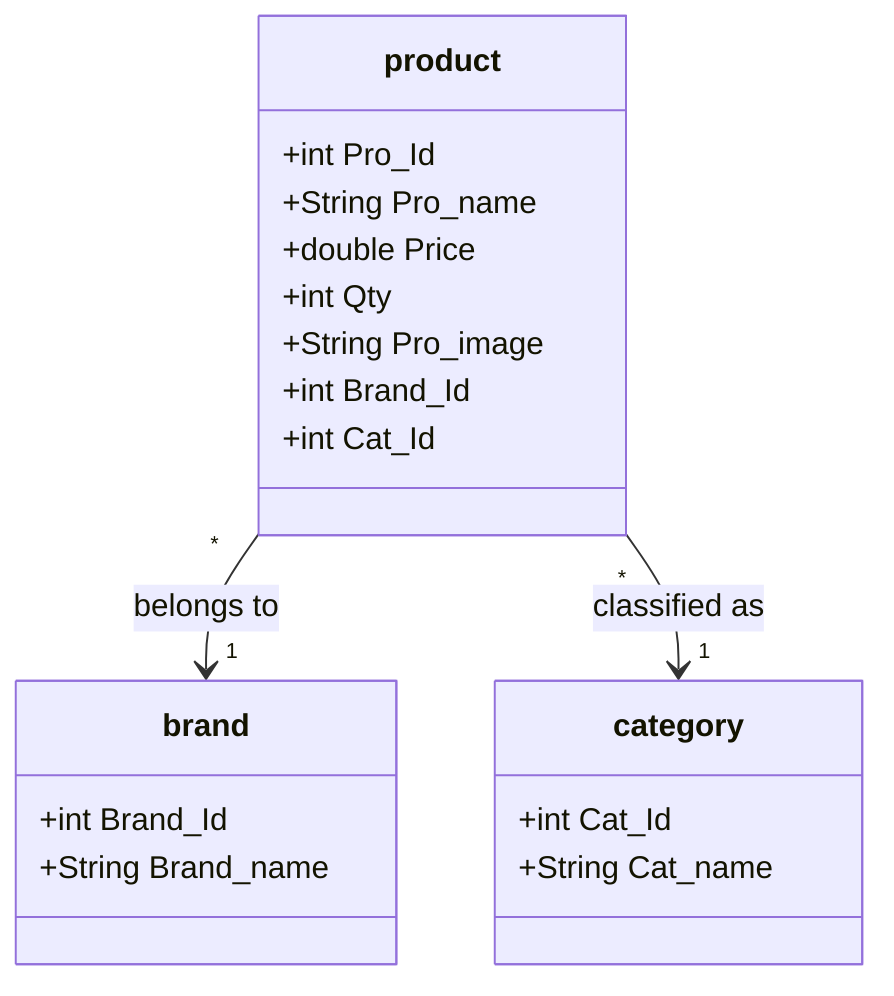
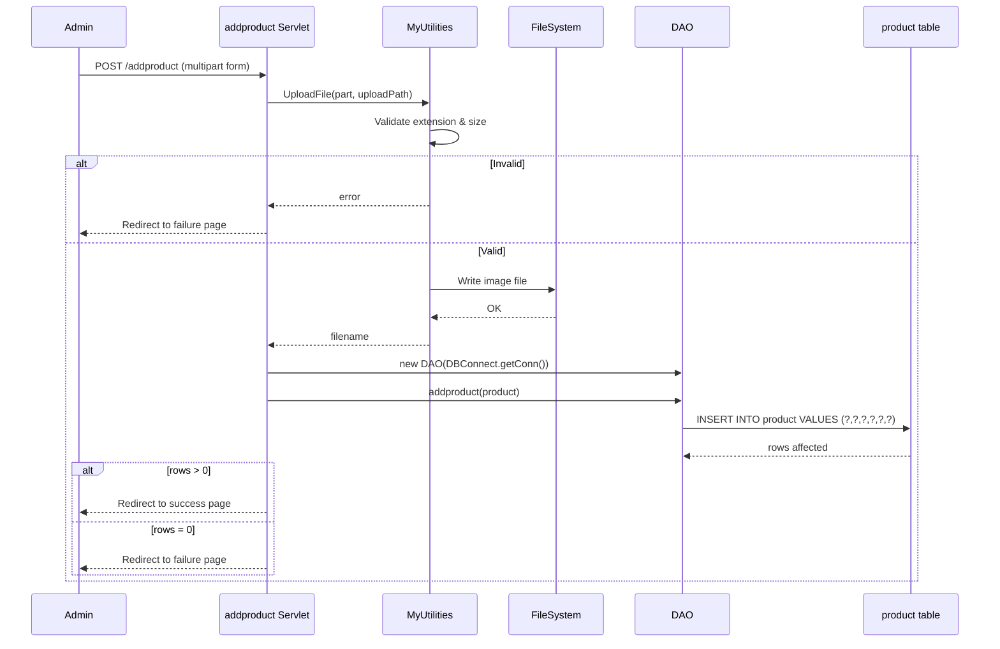

# FUREQ-003: Product Catalogue Management

**Functional Requirement ID:** FUREQ-003  
**Version:** 1.0  
**Derived From:** BUREQ-004-01, BUREQ-004-02, BUREQ-004-03, BUREQ-004-04, BUREQ-011-01, BUREQ-011-02, BUREQ-011-03, BUREQ-011-04  
**Traced To Use Cases:** UC-004, UC-011  
**Traced To Processes:** BP-002, BP-004  

---

## Overview

The product catalogue allows users (guest, customer, admin) to browse all available products or filter by category. Administrators can add new products with image uploads. Products are the central entity around which the shopping experience is built.

---

## Functional Requirements

### FUREQ-003-01: Display All Products

**Source:** BUREQ-004-01  
**Description:** The system shall retrieve and display all products from the `viewlist` database view, presenting each with image, name, price, brand, and category.

**Implementation:**  
- JSPs: `index.jsp` (guest home), `customerhome.jsp` (customer), `adminhome.jsp` (admin)  
- DAO: `DAO.getViewlist()` (or equivalent in relevant DAO class)  
- SQL (via `viewlist`): `SELECT * FROM viewlist`  
- Entity: `com.entity.viewlist`

---

### FUREQ-003-02: Filter Products by Category

**Source:** BUREQ-004-02  
**Description:** The system shall support browsing products filtered by one of four predefined categories: Mobile, TV, Laptop, Watch. Category browsing must function identically for guest, customer, and admin roles.

**Implementation:**  
- Each category has a dedicated database view and set of three JSP variants:

| Category | DB View | Guest JSP | Customer JSP | Admin JSP |
|---|---|---|---|---|
| Mobile | `mobile` | `mobile.jsp` | `mobilec.jsp` | `mobilea.jsp` |
| TV | `tv` | `tv.jsp` | `tvc.jsp` | `tva.jsp` |
| Laptop | `laptop` | `laptop.jsp` | `laptopc.jsp` | `laptopa.jsp` |
| Watch | `watch` | `watch.jsp` | `watchc.jsp` | `watcha.jsp` |

- Entity classes: `com.entity.mobile`, `com.entity.tv`, `com.entity.laptop`, `com.entity.watch`

---

### FUREQ-003-03: Product Detail View

**Source:** BUREQ-004-04  
**Description:** From any product listing, the user shall be able to navigate to a product detail page showing all product attributes including stock quantity.

**Implementation:**  
- Product detail rendered in the same or a linked JSP using query parameters passed on the "Add to Cart" link/form  
- Product attributes from the `product` table: `Pro_Id`, `Pro_name`, `Price`, `Qty`, `Pro_image`, `Brand_Id`, `Cat_Id`

---

### FUREQ-003-04: Admin Add Product — Form Submission

**Source:** BUREQ-011-01, BUREQ-011-02, BUREQ-011-04  
**Description:** An authenticated admin shall be able to submit a multipart form containing product attributes and a product image. The form shall only be accessible to authenticated admins.

**Implementation:**  
- Servlet: `com.servlet.addproduct` (`@WebServlet("/addproduct")`, `@MultipartConfig`)  
- Form page: `addproduct.jsp`  
- Authentication gate: presence of `tname` cookie (checked in JSP)  
- Form fields: `Pro_name`, `Price`, `Qty`, `Pro_image` (file), `Brand_Id`, `Cat_Id`

---

### FUREQ-003-05: Image Validation

**Source:** BUREQ-011-01  
**Description:** The system shall reject uploaded images that do not conform to the allowed types or exceed the maximum size.

**Implementation:**  
- Utility: `com.utility.MyUtilities.UploadFile()`  
- Allowed extensions: `.jpg`, `.bmp`, `.jpeg`, `.png`, `.webp`  
- Maximum size: 10 MB (10,240 KB)  
- Extension extracted from `Part.getSubmittedFileName()`  
- Validation failure → servlet returns error; admin shown failure response

---

### FUREQ-003-06: Image Storage

**Source:** BUREQ-011-01  
**Description:** Valid product images shall be saved to a configured server-side directory.

**Implementation:**  
- `MyUtilities.UploadFile()` writes the file to the path configured in `DAO.java` (hardcoded upload path)  
- Original filename is used as-is (no sanitisation or renaming)  
- The filename is subsequently stored in `product.Pro_image` and used as the product identifier in cart and order records

---

### FUREQ-003-07: Product Record Persistence

**Source:** BUREQ-011-02, BUREQ-011-03  
**Description:** After successful image upload, the system shall insert a new product record and redirect the admin to a confirmation page.

**Implementation:**  
- DAO: `DAO.addproduct(product p)` in `com.dao.DAO`  
- SQL: `INSERT INTO product (Pro_name, Price, Qty, Pro_image, Brand_Id, Cat_Id) VALUES (?,?,?,?,?,?)`  
- Brand mapping (hardcoded): Samsung=1, Sony=2, Lenovo=3, Acer=4, Onida=5  
- Category mapping (hardcoded): Laptop=1, TV=2, Mobile=3, Watch=4  
- Success → redirect to success page; failure → redirect to fail page

---

## Brand and Category Data Model

---

## Add Product Flow

---

## Known Limitations

- No product editing or deletion is supported through the UI.  
- Brand and category IDs are hardcoded in the servlet — adding new brands/categories requires code changes.  
- Image filename is used as the product surrogate key in cart and order records; renaming the file breaks cart integrity.  
- The original image filename is used without sanitisation (path traversal risk).
