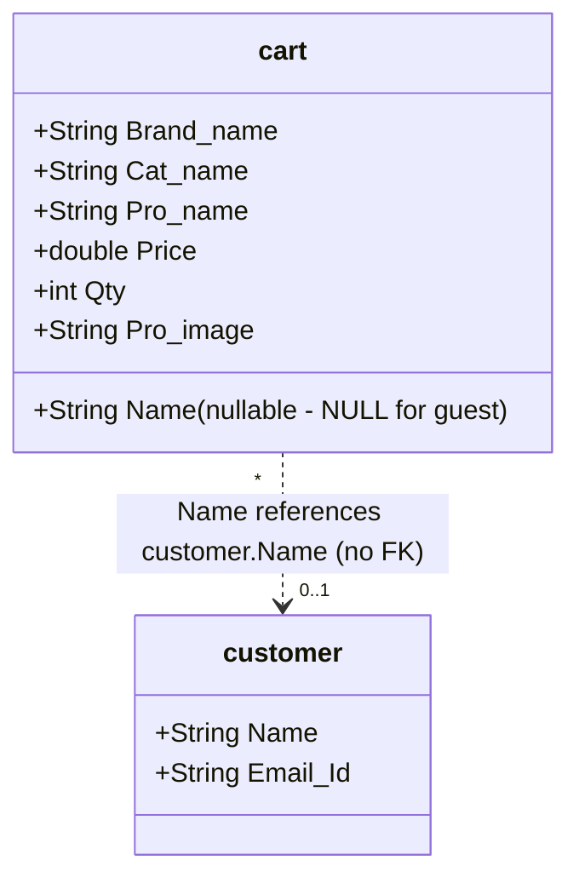
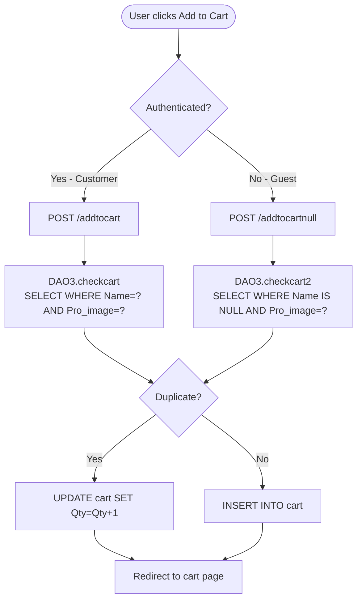

# FUREQ-004: Shopping Cart Management

**Functional Requirement ID:** FUREQ-004  
**Version:** 1.0  
**Derived From:** BUREQ-005-01, BUREQ-005-02, BUREQ-005-03, BUREQ-005-04, BUREQ-006-01, BUREQ-006-02, BUREQ-006-03, BUREQ-006-04  
**Traced To Use Cases:** UC-005, UC-006  
**Traced To Processes:** BP-002  

---

## Overview

The shopping cart supports both anonymous (guest) and authenticated (customer) modes. Cart items are persisted in the `cart` table and identified by the customer's name (or NULL for guests). The system supports adding products, deduplicating via quantity increment, and removing items. Admin users can also manage cart records through the admin data table views.

---

## Functional Requirements

### FUREQ-004-01: Add to Cart — Authenticated Customer

**Source:** BUREQ-005-02, BUREQ-005-03, BUREQ-005-04  
**Description:** A logged-in customer shall be able to add a product to their personal cart. If the product already exists, its quantity shall be incremented by 1. Otherwise, a new cart row shall be created.

**Implementation:**  
- Servlet: `com.servlet.addtocart` (`@WebServlet("/addtocart")`)  
- Customer identified by `cname` cookie  
- DAO: `DAO3.checkcart(cart c)` — checks for existing row  
- SQL check: `SELECT * FROM cart WHERE Name=? AND Pro_name=? AND Brand_name=? AND Cat_name=? AND Price=? AND Pro_image=?`  
- If duplicate → `DAO3.addqty(cart c)`: `UPDATE cart SET Qty = Qty+1 WHERE Name=? AND Pro_image=?`  
- If new → `DAO3.addtocart(cart c)`: `INSERT INTO cart VALUES (?,?,?,?,?,?,?)`

---

### FUREQ-004-02: Add to Cart — Guest (Anonymous)

**Source:** BUREQ-005-01, BUREQ-005-03  
**Description:** A guest user shall be able to add products to an anonymous cart (no customer name required). The same duplicate check and quantity increment rules apply.

**Implementation:**  
- Servlet: `com.servlet.addtocartnull` (`@WebServlet("/addtocartnull")`)  
- Cart rows stored with `Name = NULL`  
- DAO: `DAO3.checkcart2(cart c)` — `SELECT * FROM cart WHERE Name IS NULL AND Pro_name=? AND Brand_name=? ...`  
- If duplicate → `DAO3.addqty2(cart c)`: `UPDATE cart SET Qty = Qty+1 WHERE Name IS NULL AND Pro_image=?`  
- If new → `DAO3.addtocartnull(cart c)`: `INSERT INTO cart VALUES (NULL,?,?,?,?,?,?)`

---

### FUREQ-004-03: Cart Display

**Source:** BUREQ-006-01  
**Description:** The system shall display all cart items for the current user including product name, brand, category, price, and quantity.

**Implementation:**  
- Customer cart: `cart.jsp` — queries `SELECT * FROM cart WHERE Name=?` (via DAO)  
- Guest cart: `cartnull.jsp` — queries `SELECT * FROM cart WHERE Name IS NULL`  
- Admin table view: `table_cart.jsp` — shows all cart rows across all users  
- Entity: `com.entity.cart`

---

### FUREQ-004-04: Remove Cart Item — Customer

**Source:** BUREQ-006-02, BUREQ-006-03  
**Description:** A customer shall be able to remove any item from their personal cart.

**Implementation:**  
- Servlet: `com.servlet.removecart` (`@WebServlet("/removecart")`)  
- DAO: `DAO3.removecart(cart c)`  
- SQL: `DELETE FROM cart WHERE Name=? AND Pro_image=?`  
- After deletion → redirect back to `cart.jsp`

---

### FUREQ-004-05: Remove Cart Item — Guest

**Source:** BUREQ-006-02, BUREQ-006-03  
**Description:** A guest shall be able to remove any item from the anonymous cart.

**Implementation:**  
- Servlet: `com.servlet.removecartnull` (`@WebServlet("/removecartnull")`)  
- DAO: `DAO3.removecartnull(cart c)`  
- SQL: `DELETE FROM cart WHERE Name IS NULL AND Pro_image=?`  
- After deletion → redirect back to `cartnull.jsp`

---

### FUREQ-004-06: Remove Cart Item — Admin

**Source:** BUREQ-006-04  
**Description:** An administrator shall be able to remove any cart row (from any user) via the admin table view.

**Implementation:**  
- Servlets:  
  - `com.servlet.removecarta` (`@WebServlet("/removecarta")`) — removes named-customer cart item  
  - `com.servlet.removecartnulla` (`@WebServlet("/removecartnulla")`) — removes guest cart item  
  - `com.servlet.removetable_cart` (`@WebServlet("/removetable_cart")`) — removes cart row by ID from the admin table view  
- After deletion → redirect to respective admin table/cart page

---

## Cart Data Model

---

## Add to Cart Flow

---

## Cart Item Identification

Cart items are identified by a combination of `Name` (or NULL), `Pro_image`, `Pro_name`, `Brand_name`, `Cat_name`, and `Price`. There is no auto-generated cart item ID. This means:

- `Pro_image` (filename) effectively acts as the product surrogate key in the cart.
- Changing a product image filename will break cart duplicate detection.

---

## Known Limitations

- No expiry on cart items — items persist indefinitely unless removed or cleared at checkout.
- No cart total is computed server-side; JSPs compute the running total inline.
- Guest cart items are not merged with the customer's personal cart on login — the null-name cart is used directly for checkout.
- No stock quantity validation on add-to-cart — items can be added beyond available `Qty`.
