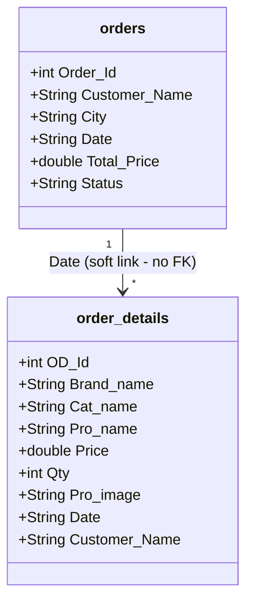
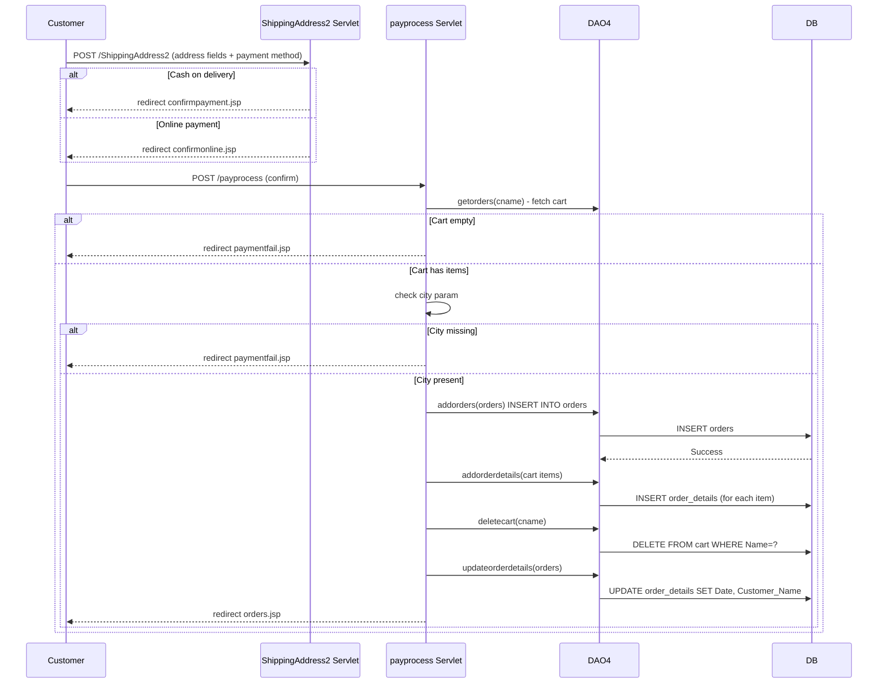

# FUREQ-005: Checkout and Order Management

**Functional Requirement ID:** FUREQ-005  
**Version:** 1.0  
**Derived From:** BUREQ-007-01 to BUREQ-007-06, BUREQ-008-01 to BUREQ-008-03, BUREQ-009-01 to BUREQ-009-03  
**Traced To Use Cases:** UC-007, UC-008, UC-009  
**Traced To Processes:** BP-003  

---

## Overview

The checkout flow converts a populated cart into a persisted order. The process involves shipping address capture, payment method selection, and a multi-step database operation (insert order → copy cart items → delete cart → update order details). Order history viewing and cancellation are also covered here.

---

## Functional Requirements

### FUREQ-005-01: Shipping Address Capture

**Source:** BUREQ-007-02, BUREQ-007-03  
**Description:** The system shall present a shipping address form collecting: customer name, address, city, state, country, and postal code. The customer shall select exactly one payment method (cash on delivery or online payment).

**Implementation:**  
- Form page: `ShippingAddress.jsp`  
- Servlet: `com.servlet.ShippingAddress2` (`@WebServlet("/ShippingAddress2")`, `@MultipartConfig`)  
- `doPost()` reads `paymentmethod` parameter  
- Cash on delivery → redirect `confirmpayment.jsp`  
- Online payment → redirect `confirmonline.jsp`  
- Shipping address fields are forwarded as request parameters

---

### FUREQ-005-02: Payment Route Selection

**Source:** BUREQ-007-03  
**Description:** Based on the payment method selected, the system routes to a different confirmation page. Both paths lead to the same order creation servlet.

**Implementation:**  
- `ShippingAddress2` servlet performs routing only — no DAO calls  
- Both `confirmpayment.jsp` and `confirmonline.jsp` submit to `POST /payprocess`

---

### FUREQ-005-03: Order Validation

**Source:** BUREQ-007-01, BUREQ-007-02  
**Description:** Before creating an order, the system shall validate that the cart is not empty and that a city has been provided.

**Implementation:**  
- Servlet: `com.servlet.payprocess` (`@WebServlet("/payprocess")`)  
- Cart check: `DAO4.getorders(cname)` → if result list is empty → redirect `paymentfail.jsp` ("Add items to cart first")  
- City check: `city` parameter must be non-empty → else redirect `paymentfail.jsp` ("Select any item first")

---

### FUREQ-005-04: Order Record Creation

**Source:** BUREQ-007-04, BUREQ-007-05  
**Description:** The system shall insert a new order record with status "Processing" as the first step in the order creation sequence.

**Implementation:**  
- DAO: `DAO4.addorders(orders o)` in `com.dao.DAO4`  
- SQL: `INSERT INTO orders (Customer_Name, City, Total_Price, Status) VALUES (?,?,?,?)`  
- `Status` hardcoded to `"Processing"` in all cases  
- Failure → redirect `paymentfail.jsp`  
- Entity: `com.entity.orders`

---

### FUREQ-005-05: Order Details Population

**Source:** BUREQ-007-04  
**Description:** After creating the order header, the system shall copy all cart items for the customer into the `order_details` table.

**Implementation:**  
- DAO: `DAO4.addorderdetails(cart c)` for each cart item  
- SQL: `INSERT INTO order_details (Brand_name, Cat_name, Pro_name, Price, Qty, Pro_image) VALUES (?,?,?,?,?,?)`  
- Source: cart items fetched by `DAO4.getorders(cname)` (or equivalent cart query)  
- Failure at any insert → redirect `paymentfail.jsp`

---

### FUREQ-005-06: Cart Clearance

**Source:** BUREQ-007-04  
**Description:** After all cart items are copied to order details, the system shall delete all cart items for the customer/guest.

**Implementation:**  
- DAO: `DAO4.deletecart(cname)` (customer) or equivalent null-name delete  
- SQL: `DELETE FROM cart WHERE Name=?` (or `Name IS NULL` for guest)  
- Failure → redirect `paymentfail.jsp`

---

### FUREQ-005-07: Order Details Finalisation

**Source:** BUREQ-007-04  
**Description:** After cart clearance, the system shall update the order details with the current date and the customer's name.

**Implementation:**  
- DAO: `DAO4.updateorderdetails(orders o)`  
- SQL: `UPDATE order_details SET Date=?, Customer_Name=? WHERE Date IS NULL` (or equivalent)  
- Success → redirect `orders.jsp`  
- Failure → redirect `paymentfail.jsp`

---

### FUREQ-005-08: View Order History

**Source:** BUREQ-008-01, BUREQ-008-02  
**Description:** A logged-in customer shall be able to view all their orders as a list showing order ID, city, date, total price, and status.

**Implementation:**  
- JSP: `orders.jsp`  
- Customer identified by `cname` cookie  
- DAO: query `SELECT * FROM orders WHERE Customer_Name=?`  
- Entity: `com.entity.orders`

---

### FUREQ-005-09: View Order Line Items

**Source:** BUREQ-008-03  
**Description:** A customer shall be able to click on an order to view all line items (product name, brand, category, price, quantity, and subtotal).

**Implementation:**  
- JSP: `orderdetails.jsp?id=<date>`  
- DAO: `SELECT * FROM orders WHERE Date=?` + `SELECT * FROM order_details WHERE Date=?`  
- Note: Orders are linked to their details via the `Date` field, not a formal foreign key

---

### FUREQ-005-10: Order Cancellation — Customer

**Source:** BUREQ-009-01, BUREQ-009-03  
**Description:** A customer shall be able to remove an order by its ID. The orders page shall refresh after deletion.

**Implementation:**  
- Servlet: `com.servlet.removeorders` (`@WebServlet("/removeorders")`)  
- Parameter: `id` = `Order_Id`  
- DAO: `DAO4.removeorders(orders o)`  
- SQL: `DELETE FROM orders WHERE Order_Id=?`  
- Redirect: `orders.jsp`

---

### FUREQ-005-11: Order Cancellation — Admin

**Source:** BUREQ-009-02  
**Description:** An admin shall be able to remove any order from the admin order management view.

**Implementation:**  
- Servlet: `com.servlet.remove_orders` (`@WebServlet("/remove_orders")`)  
- DAO: `DAO4.removeorders(orders o)`  
- SQL: `DELETE FROM orders WHERE Order_Id=?`  
- Redirect: `table_orders.jsp`

---

## Order Entity Model

---

## Checkout Sequence

---

## Known Limitations

- The four-step order creation is **not wrapped in a database transaction** — partial failure may leave orphaned order or order_detail records.
- Orders are linked to `order_details` via the `Date` field (soft link), not a proper foreign key — date collisions could cause incorrect joins.
- Cancelling an order (`DELETE FROM orders`) does **not** delete associated `order_details` rows.
- Order status is always `"Processing"` — no status transitions (shipped, delivered, refunded) are implemented.
