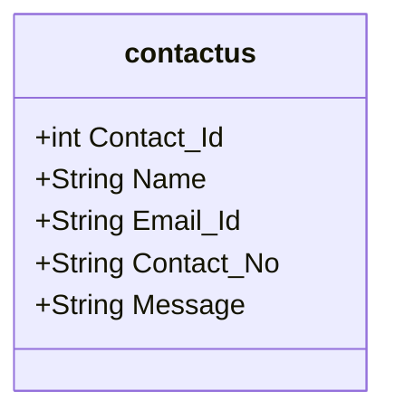
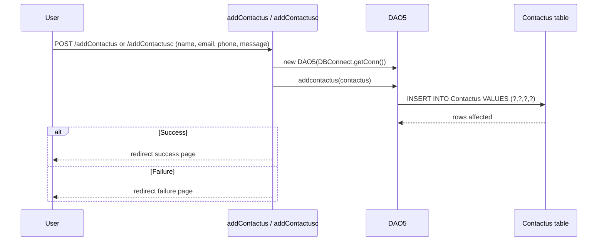
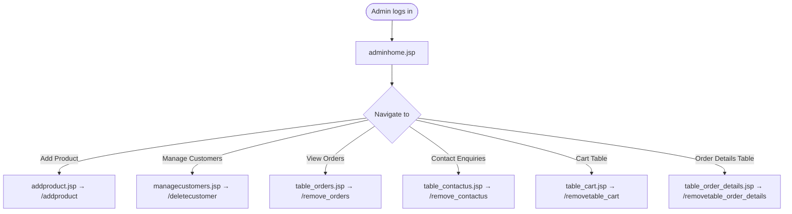

# FUREQ-006: Contact Us and Admin Operations

**Functional Requirement ID:** FUREQ-006  
**Version:** 1.0  
**Derived From:** BUREQ-010-01 to BUREQ-010-03, BUREQ-012-01 to BUREQ-012-03, BUREQ-013-01 to BUREQ-013-03, BUREQ-014-01, BUREQ-014-02  
**Traced To Use Cases:** UC-010, UC-012, UC-013, UC-014  
**Traced To Processes:** BP-005, BP-006  

---

## Overview

This document covers two functional areas:  
1. **Contact Us** — allows guests and customers to submit enquiries.  
2. **Admin Operations** — covers customer management, enquiry management, and the admin dashboard.

---

## Functional Requirements — Contact Us

### FUREQ-006-01: Submit Contact Enquiry — Guest

**Source:** BUREQ-010-01, BUREQ-010-02, BUREQ-010-03  
**Description:** A guest user shall be able to submit an enquiry by providing their name, email, phone, and message. The enquiry shall be persisted and the guest informed of the outcome.

**Implementation:**  
- Servlet: `com.servlet.addContactus` (`@WebServlet("/addContactus")`, `@MultipartConfig`)  
- DAO: `DAO5.addcontactus(contactus c)` in `com.dao.DAO5`  
- SQL: `INSERT INTO Contactus (Name, Email_Id, Contact_No, Message) VALUES (?,?,?,?)`  
- Entity: `com.entity.contactus`  
- Success → redirect to guest success page; failure → redirect to guest failure page

---

### FUREQ-006-02: Submit Contact Enquiry — Customer

**Source:** BUREQ-010-01, BUREQ-010-02, BUREQ-010-03  
**Description:** An authenticated customer shall be able to submit an enquiry via a separate servlet that redirects to customer-specific confirmation pages.

**Implementation:**  
- Servlet: `com.servlet.addContactusc` (`@WebServlet("/addContactusc")`, `@MultipartConfig`)  
- Uses same DAO5 method and SQL as the guest flow  
- Redirects differ: customer-facing success/fail JSPs include the customer navbar

---

### FUREQ-006-03: Admin — View and Delete Enquiries

**Source:** BUREQ-013-01, BUREQ-013-02, BUREQ-013-03  
**Description:** An admin shall be able to view all contact enquiries and delete any entry by its ID.

**Implementation:**  
- View JSP: `table_contactus.jsp`  
- DAO: `DAO5.getcontactus()` — `SELECT * FROM Contactus`  
- Delete Servlet: `com.servlet.remove_contactus` (`@WebServlet("/remove_contactus")`)  
- DAO: `DAO5.removecontactus(contactus c)` — `DELETE FROM Contactus WHERE Contact_Id=?`  
- After deletion → redirect `table_contactus.jsp`

---

## Functional Requirements — Admin Operations

### FUREQ-006-04: Admin Dashboard

**Source:** BUREQ-014-01, BUREQ-014-02  
**Description:** The admin dashboard shall display a product overview with image slideshow and category carousel using products from all four categories.

**Implementation:**  
- JSP: `adminhome.jsp`  
- Data source: `viewlist` database view (all products)  
- Navigation bar includes links to: Add Product, Manage Customers, View Orders, Contact Enquiries, Data Tables  
- Authentication gate: `tname` cookie required

---

### FUREQ-006-05: Admin — View and Delete Customers

**Source:** BUREQ-012-01, BUREQ-012-02, BUREQ-012-03  
**Description:** An admin shall be able to view all registered customers and permanently delete any customer account by name and email.

**Implementation:**  
- View JSP: `managecustomers.jsp`  
- DAO: `DAO2.getcustomer()` — `SELECT * FROM customer`  
- Delete Servlet: `com.servlet.deletecustomer` (`@WebServlet("/deletecustomer")`)  
- DAO: `DAO2.deletecustomer(customer c)` — `DELETE FROM customer WHERE Name=? AND Email_Id=?`  
- After deletion → redirect `managecustomers.jsp`

---

### FUREQ-006-06: Admin — Data Table Management

**Source:** (Admin operations — general)  
**Description:** Admin users can view and remove individual rows from the cart, orders, and order_details tables via dedicated admin table JSPs.

**Implementation:**  
- Cart table: `table_cart.jsp` + `com.servlet.removetable_cart` (`@WebServlet("/removetable_cart")`)  
- Order details table: `table_order_details.jsp` + `com.servlet.removetable_order_details` (`@WebServlet("/removetable_order_details")`)  
- Orders table: `table_orders.jsp` + `com.servlet.remove_orders` (`@WebServlet("/remove_orders")`), `com.servlet.removeorders` (`@WebServlet("/removeorders")`)

---

## Contact Us Data Model

---

## Contact Us Submission Flow

---

## Admin Operations Overview

---

## Known Limitations

- Deleting a customer does **not** cascade to their cart items or order records.
- There is no email notification or response mechanism for contact enquiries.
- Admin authentication is checked only in JSPs (via `tname` cookie check), not enforced at the servlet level.
