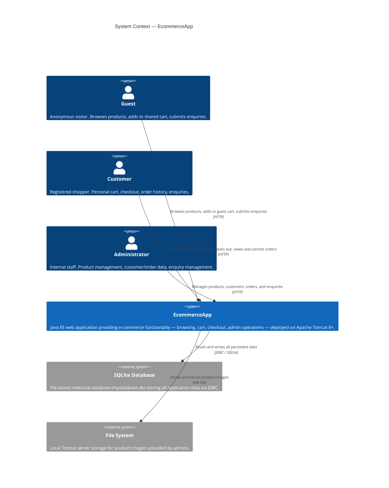
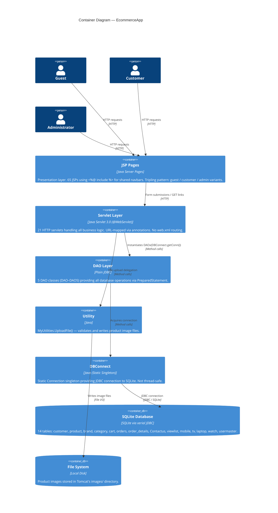
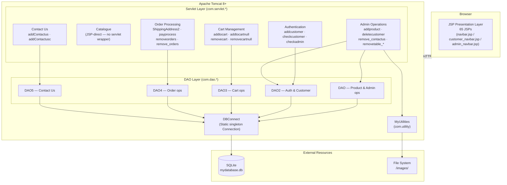
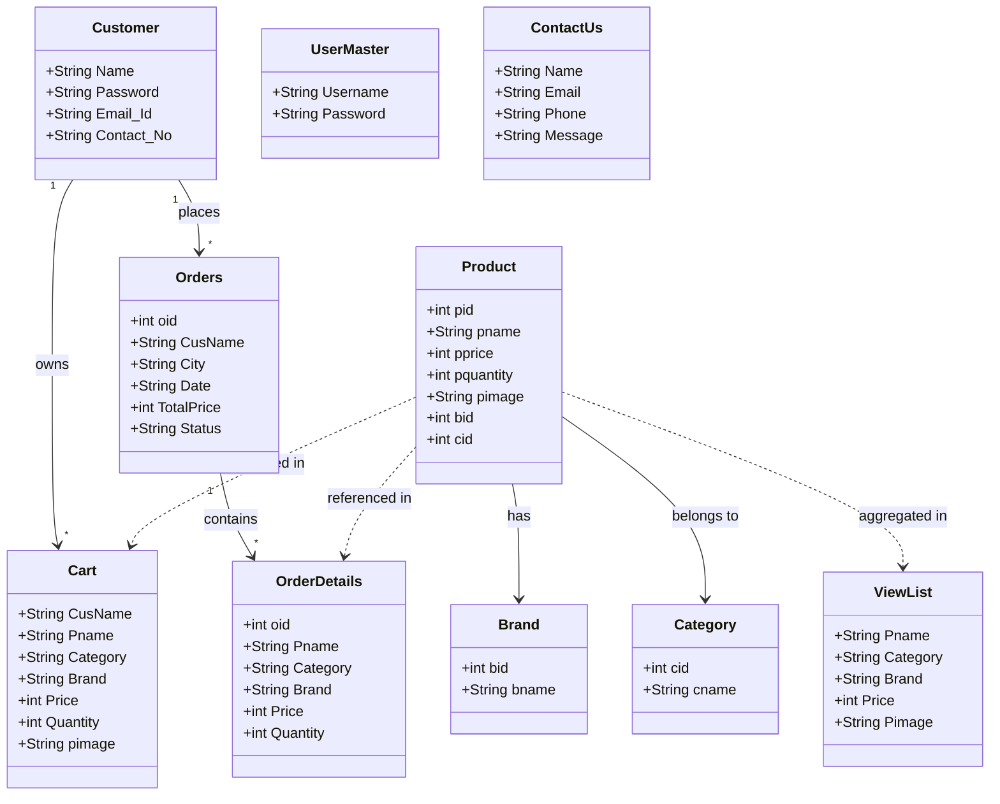
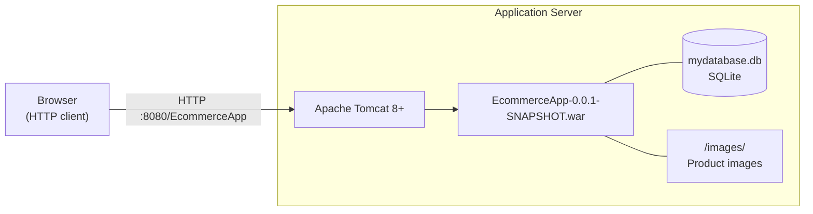
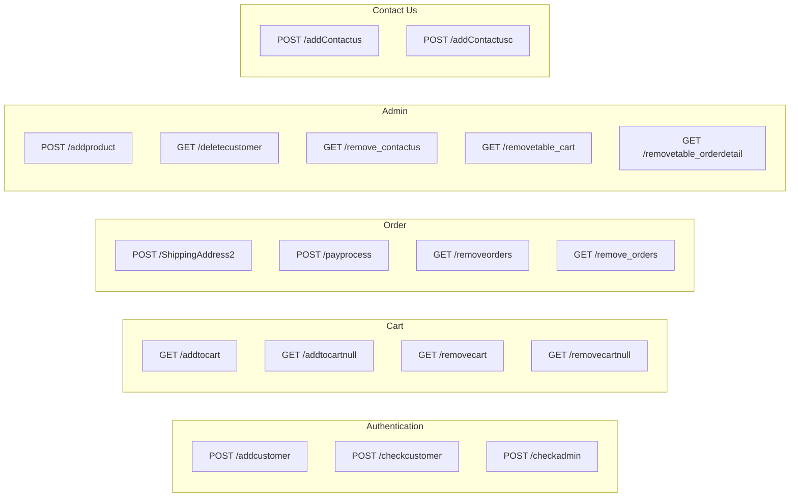

# System Overview — EcommerceApp

**Document ID:** SO-001  
**Version:** 1.1  
**Phase:** Coordination (second pass, post-verification remediation)  
**Traced To:** DIAG-001, INT-001, INT-002, All FUREQs  

---

## Purpose

EcommerceApp is an online electronic retail platform built with Java EE (Servlet 3.0 + JSP) deployed on Apache Tomcat 8+. It supports three actor types — **Guest**, **Customer**, and **Admin** — across the full e-commerce lifecycle: product discovery, cart management, checkout, order tracking, and administrative operations.

---

## C4 Context Diagram

---

## C4 Container Diagram

---

## Component Flow Diagram

---

## Domain Model Overview

---

## Deployment Architecture

**Deployment Notes:**
- The WAR is built via `mvn package` from the `EcommerceApp/` directory.
- Before deployment: update the hardcoded SQLite path in `DBConnect.java` and image upload path in `DAO.java`.
- Auth is cookie-based (`cname` = customer email, `tname` = admin username); cookies have `maxAge=9999` for persistence.
- Flash messages use short-lived cookies (`maxAge=10`) for redirect feedback.

---

## Servlet URL Routing

---

## Technology Stack Summary

| Layer | Technology | Notes |
|---|---|---|
| Language | Java (J2EE) | Servlet 3.0 API |
| Presentation | JSP (Scriptlets) | 65 JSPs; tripling pattern for guest/customer/admin |
| Routing | `@WebServlet` annotations | 21 servlets; no `web.xml` URL mappings |
| Data Access | Plain JDBC (`PreparedStatement`) | 5 DAO classes; no ORM |
| Database | SQLite via `org.xerial:sqlite-jdbc` | Single file DB; static connection singleton |
| Build | Apache Maven (WAR packaging) | Output: `EcommerceApp-0.0.1-SNAPSHOT.war` |
| Server | Apache Tomcat 8+ | Standard servlet container |
| Authentication | Browser cookies | `cname` (customer email), `tname` (admin name) |
| File Storage | Local file system | Product images in Tomcat `images/` directory |

---

## Known Architectural Constraints

| Constraint | Impact |
|---|---|
| Static `DBConnect` singleton | Not thread-safe; concurrent requests may corrupt DB state |
| Hardcoded brand/category mappings | New brands/categories require code changes |
| Cookie-based auth (no `HttpOnly`/`Secure`) | Susceptible to XSS-based session theft |
| Plaintext passwords in DB | No password hashing |
| No transaction management | Order creation is a multi-step non-atomic operation |
| File upload uses original filename | Path traversal risk if filename contains `../` |

---

*See also: [DIAG-001 System Architecture](functional/diagrams/DIAG-001-system-architecture.md) | [INT-001 Database](functional/integration/INT-001-database.md) | [INT-002 File System](functional/integration/INT-002-file-system.md)*
